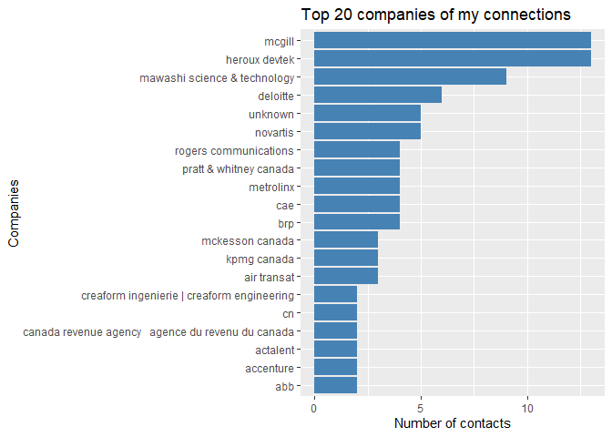
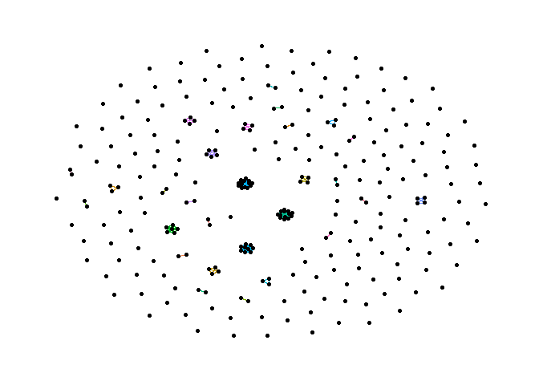

Exercise 1 - LinkedIn Contacts
================
Samuel
2022-05-04

# Check the data

``` r
df <- read.csv("linkedin_connections.csv", skip = 3)

df <- clean_names(df)

df <- df %>% 
  select(-c("email_address"))
```

# Standardize the name of the companies

There are still some duplicates with inc. or canada. A more systematic
way by using the companies name resemblance could be used but that’s not
the goal of this project and most of the duplicates were fixed by doing
these simple fix.

``` r
# Lower case company name
df <- 
  df %>% 
  mutate(company = tolower(company))  # lower case

# Remove all chinese characters (prevent pdf export)
df <- df %>% mutate(company = str_replace_all(company,"[\u2E80-\u2FD5\u3190-\u319f\u3400-\u4DBF\u4E00-\u9FCC\uF900-\uFAAD]", ""),
                    position = str_replace_all(company,"[\u2E80-\u2FD5\u3190-\u319f\u3400-\u4DBF\u4E00-\u9FCC\uF900-\uFAAD]", ""))

# If no company, write "unknown"
df <- 
  df %>% 
  mutate(company = replace_na(company, "None")) %>% 
  mutate(company = replace(company, company=="", "unknown"))

# Remove accents in the column
df$company <- stri_trans_general(str=df$company, id="Latin-ASCII")

# Replace everything starting with McGill by just McGill
df <- df %>% 
  mutate(company = replace(company, str_detect(company, "mcgill"), "mcgill"))

# Remove "-" and replace with space
df <- df %>% 
  mutate(company = str_replace(company, "-", " "))

# PRIVACY
#df %>% head(10)
```

# Get the count of contacts by company

``` r
count <- df %>% 
  group_by(company) %>% 
  count() %>% 
  arrange(desc(n))
  
count %>% arrange(desc(n)) %>% head(20) %>% 
  ggplot(aes(y = reorder(company,n), x=n))+
  geom_col(fill="steelblue") +
  labs(
    x = "Number of contacts",
    y = "Companies",
    title = "Top 20 companies of my connections"
  )
```

<!-- -->

# Get the total count

``` r
total_count = sum(count$n)
print(c("Total connections = ", total_count))
```

    ## [1] "Total connections = " "278"

# Create the graph

## Create a column with the first and last name

``` r
df <- df %>% 
  unite(name, c("first_name", "last_name"))
```

## Remove the unknown company contacts from the network

``` r
df <- df %>% filter(company!="unknown")
```

## Create the nodes

``` r
nodes <- df %>% select(c("name", "company"))

nodes <- nodes %>% rowid_to_column("id")

# PRIVACY
#nodes %>% head(10)
```

## Create the edges

Left join the id of the contact’s name with the same company name

``` r
edges <- df %>% select(c(name, company)) %>% 
  left_join(nodes %>% select(c(id,name)), by = c("name"="name"))

edges <- edges %>% left_join(edges, by = "company", keep=FALSE) %>% 
  select(c("id.x", "id.y", "company")) %>% 
  filter(id.x!=id.y) # remove the connections between itself

colnames(edges) <- c("x", "y", "company")

edges %>% head(10)
```

    ##    x   y                 company
    ## 1  2  95                      cn
    ## 2  6  34             air transat
    ## 3  6 101             air transat
    ## 4  7  21 keurig dr pepper canada
    ## 5  8  16                  mcgill
    ## 6  8  52                  mcgill
    ## 7  8  58                  mcgill
    ## 8  8  61                  mcgill
    ## 9  8  65                  mcgill
    ## 10 8  67                  mcgill

## Create the graph

``` r
library(tidygraph)
```

    ## 
    ## Attaching package: 'tidygraph'

    ## The following object is masked from 'package:igraph':
    ## 
    ##     groups

    ## The following object is masked from 'package:stats':
    ## 
    ##     filter

``` r
library(ggraph)

graph <- tbl_graph(edges = edges, nodes=nodes, directed = FALSE)
```

## Plot the resulting full graph

``` r
ggraph(graph, layout = "graphopt") + 
  geom_edge_link(aes(color = company), show.legend = FALSE) + 
  geom_node_point()+
  theme_graph()
```

<!-- -->
