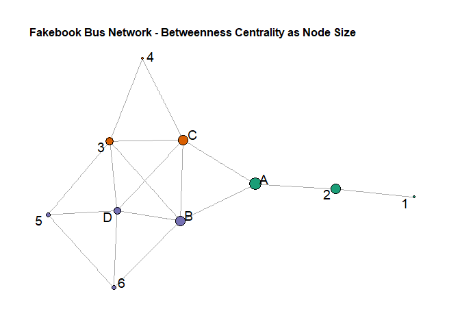

Exercise 2 - Fakebook Bus
================
Samuel
2022-05-13

# References

<https://mr.schochastics.net/material/netvizr/>

# Objective

The goal of this exercise is to find the optimal position to sit in the
bus.

We’ll look at the network of the people in the bus.

# Creating the dataset

## Nodes

``` r
nodes <- data.frame(Nodes = c(1,2,3,4,5,6,"A","B","C","D"))
nodes %>% head()
```

    ##   Nodes
    ## 1     1
    ## 2     2
    ## 3     3
    ## 4     4
    ## 5     5
    ## 6     6

## Edges

For simplicity, those were created manually in Excel because it was
easier to do compared to in R.

``` r
edges <- readxl::read_excel("ex2_edges.xlsx")
edges %>% head()
```

    ## # A tibble: 6 × 2
    ##   x     y    
    ##   <chr> <chr>
    ## 1 1     2    
    ## 2 2     1    
    ## 3 2     A    
    ## 4 A     2    
    ## 5 A     B    
    ## 6 A     C

### Unidirectionnal edges

Doing that to remove the duplicates directions so the centrality
measures will be accurate. Counted twice otherwise.

``` r
edges <- as_data_frame(simplify(graph_from_data_frame(edges, directed=FALSE)))
```

# Creating the graph

``` r
graph <- tbl_graph(edges = edges, nodes=nodes, directed = FALSE)
autograph(graph)
```

<!-- -->

# Visualize

Possible layouts: igraph_layouts \<- c(‘star’, ‘circle’, ‘gem’, ‘dh’,
‘graphopt’, ‘grid’, ‘mds’, ‘randomly’, ‘fr’, ‘kk’, ‘drl’, ‘lgl’)

## Computing different parameters for the Network Graph

``` r
# Clustering for node colors:
V(graph)$clu <- as.character(membership(cluster_louvain(graph)))

# Degree Centrality
V(graph)$degree <- degree(graph)

# Betweenness centrality
V(graph)$bet_centrality <- betweenness(graph)
```

Showing the degree of the vertex

``` r
V(graph)$degree
```

    ##  [1] 1 2 5 2 3 3 3 5 5 5

Betweenes of the vertex

``` r
V(graph)$bet_centrality
```

    ##  [1]  0.0000000  8.0000000  4.6333333  0.0000000  0.5333333  0.9333333
    ##  [7] 14.0000000  9.0333333  8.6000000  3.2666667

## Plot the results for Degree Centrality

``` r
ggraph(graph, layout = "stress") +
  geom_edge_link(color = "gray66") +
  geom_node_point(
    aes(fill = clu, size = degree),  # size based on graph degree centrality
    shape = 21,
    ) +
  scale_fill_brewer(palette = "Dark2", na.value = "gray53") +
  geom_node_text(
    aes(label = Nodes),
    colour = "#000000",
    size = 5,
    repel = TRUE,
  ) +
  theme_graph() +
  theme(legend.position = "none",
        plot.title = element_text(size=12)) +
  labs(title="Fakebook Bus Network - Degree Centrality as Node Size")
```

    ## Warning in grid.Call(C_stringMetric, as.graphicsAnnot(x$label)): font family not
    ## found in Windows font database

    ## Warning in grid.Call(C_textBounds, as.graphicsAnnot(x$label), x$x, x$y, : font
    ## family not found in Windows font database

    ## Warning in grid.Call(C_textBounds, as.graphicsAnnot(x$label), x$x, x$y, : font
    ## family not found in Windows font database

<!-- -->

***Analysis from this graph using degree centrality***

While the connection centrality clearly advantage B, C and D and
therefore the intern should choose between these three. From my point of
view, it would be advantageous for the intern to sit on B or C, because
it has the advantage of being connecting with the 3 groups clusters
defined with the Louvain method. Seat D is really far from the (A,2,1)
cluster.

## Plot the results for Betweenness Centrality

``` r
ggraph(graph, layout = "stress") +
  geom_edge_link(color = "gray66") +
  geom_node_point(
    aes(fill = clu, size = bet_centrality*2),  # size based on nodes betweenness
    shape = 21,
    ) +
  scale_fill_brewer(palette = "Dark2", na.value = "gray53") +
  geom_node_text(
    aes(label = Nodes),
    colour = "#000000",
    size = 5,
    repel = TRUE,
  ) +
  theme_graph() +
  theme(legend.position = "none",
        plot.title = element_text(size=12)) +
  labs(title="Fakebook Bus Network - Betweenness Centrality as Node Size")
```

    ## Warning in grid.Call(C_textBounds, as.graphicsAnnot(x$label), x$x, x$y, : font
    ## family not found in Windows font database

    ## Warning in grid.Call(C_textBounds, as.graphicsAnnot(x$label), x$x, x$y, : font
    ## family not found in Windows font database

<!-- -->

# Final conclusion

Now, using the betweenness centrality, we can see that this gives an
advantage to seat A and B. Meaning that these two nodes are bridges to
the others from the shortest path. Therefore, based on the betweenness
metric and degree centrality, we should select seat B as it is slightly
better than seat C in terms of betweenness centrality.

In real life however, if I am the last one to sit, I prefer being at the
back of the bus so then you can kind of interact with the people at the
front and if I am the first one to sit, then it’s better to be more in
front so then you can interact with people going to sit at the back!
