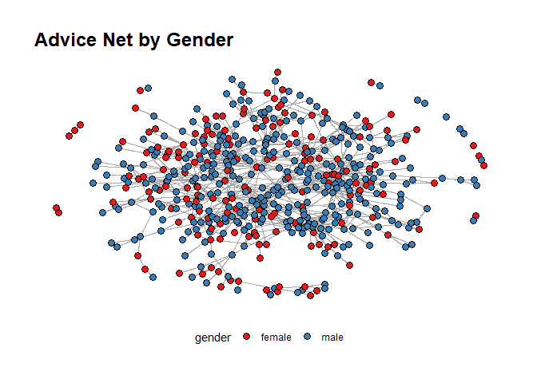

Exercise 3 - Advice Network at USPTO
================
Samuel
2022-05-18

## Instructions

1.  Load the files and add the following variables for examiners:

-   Gender
-   Race
-   Tenure

2.  Pick two workgroups you want to focus on (remember that a workgroup
    is represented by the first 3 digits of `examiner_art_unit` value)
    -   How do they compare on examiners’ demographics? Show summary
        statistics and plots.
3.  Create advice networks from `edges_sample` and calculate centrality
    scores for examiners in your selected workgroups

-   Pick measure(s) of centrality you want to use and justify your
    choice
-   Characterize and discuss the relationship between centrality and
    other examiners’ characteristics

Any types of visuals to understand the data. Look for tendencies.

<https://github.com/romangalperin/2022-ona-assignments/blob/main/exercises/ex3/exercise3.md>

## Load data

Load the following data: + applications from `app_data_sample.parquet` +
edges from `edges_sample.csv`

## Get gender for examiners

We’ll get gender based on the first name of the examiner, which is
recorded in the field `examiner_name_first`. We’ll use library `gender`
for that, relying on a modified version of their own
[example](https://cran.r-project.org/web/packages/gender/vignettes/predicting-gender.html).

Note that there are over 2 million records in the applications table –
that’s because there are many records for each examiner, as many as the
number of applications that examiner worked on during this time frame.
Our first step therefore is to get all *unique* names in a separate list
`examiner_names`. We will then guess gender for each one and will join
this table back to the original dataset. So, let’s get names without
repetition:

``` r
library(gender)
#install_genderdata_package() # only run this line the first time you use the package, to get data for it

# get a list of first names without repetitions
examiner_names <- applications %>% 
  distinct(examiner_name_first)

examiner_names
```

    ## # A tibble: 2,595 × 1
    ##    examiner_name_first
    ##    <chr>              
    ##  1 JACQUELINE         
    ##  2 BEKIR              
    ##  3 CYNTHIA            
    ##  4 MARY               
    ##  5 MICHAEL            
    ##  6 LINDA              
    ##  7 KARA               
    ##  8 VANESSA            
    ##  9 TERESA             
    ## 10 SUN                
    ## # … with 2,585 more rows

Now let’s use function `gender()` as shown in the example for the
package to attach a gender and probability to each name and put the
results into the table `examiner_names_gender`

``` r
# get a table of names and gender
examiner_names_gender <- examiner_names %>% 
  do(results = gender(.$examiner_name_first, method = "ssa")) %>% 
  unnest(cols = c(results), keep_empty = TRUE) %>% 
  select(
    examiner_name_first = name,
    gender,
    proportion_female
  )

examiner_names_gender
```

    ## # A tibble: 1,822 × 3
    ##    examiner_name_first gender proportion_female
    ##    <chr>               <chr>              <dbl>
    ##  1 AARON               male              0.0082
    ##  2 ABDEL               male              0     
    ##  3 ABDOU               male              0     
    ##  4 ABDUL               male              0     
    ##  5 ABDULHAKIM          male              0     
    ##  6 ABDULLAH            male              0     
    ##  7 ABDULLAHI           male              0     
    ##  8 ABIGAIL             female            0.998 
    ##  9 ABIMBOLA            female            0.944 
    ## 10 ABRAHAM             male              0.0031
    ## # … with 1,812 more rows

Finally, let’s join that table back to our original applications data
and discard the temporary tables we have just created to reduce clutter
in our environment.

``` r
# remove extra colums from the gender table
examiner_names_gender <- examiner_names_gender %>% 
  select(examiner_name_first, gender)

# joining gender back to the dataset
applications <- applications %>% 
  left_join(examiner_names_gender, by = "examiner_name_first")

# cleaning up
rm(examiner_names)
rm(examiner_names_gender)
gc()
```

    ##            used  (Mb) gc trigger  (Mb) max used  (Mb)
    ## Ncells  4719157 252.1    8064250 430.7  4739358 253.2
    ## Vcells 49916229 380.9   93488351 713.3 80232042 612.2

## Guess the examiner’s race

We’ll now use package `wru` to estimate likely race of an examiner. Just
like with gender, we’ll get a list of unique names first, only now we
are using surnames.

``` r
library(wru)

examiner_surnames <- applications %>% 
  select(surname = examiner_name_last) %>% 
  distinct()

examiner_surnames
```

    ## # A tibble: 3,806 × 1
    ##    surname   
    ##    <chr>     
    ##  1 HOWARD    
    ##  2 YILDIRIM  
    ##  3 HAMILTON  
    ##  4 MOSHER    
    ##  5 BARR      
    ##  6 GRAY      
    ##  7 MCMILLIAN 
    ##  8 FORD      
    ##  9 STRZELECKA
    ## 10 KIM       
    ## # … with 3,796 more rows

We’ll follow the instructions for the package outlined here
<https://github.com/kosukeimai/wru>.

``` r
examiner_race <- predict_race(voter.file = examiner_surnames, surname.only = T) %>% 
  as_tibble()
```

    ## [1] "Proceeding with surname-only predictions..."

``` r
examiner_race
```

    ## # A tibble: 3,806 × 6
    ##    surname    pred.whi pred.bla pred.his pred.asi pred.oth
    ##    <chr>         <dbl>    <dbl>    <dbl>    <dbl>    <dbl>
    ##  1 HOWARD       0.643   0.295    0.0237   0.005     0.0333
    ##  2 YILDIRIM     0.861   0.0271   0.0609   0.0135    0.0372
    ##  3 HAMILTON     0.702   0.237    0.0245   0.0054    0.0309
    ##  4 MOSHER       0.947   0.00410  0.0241   0.00640   0.0185
    ##  5 BARR         0.827   0.117    0.0226   0.00590   0.0271
    ##  6 GRAY         0.687   0.251    0.0241   0.0054    0.0324
    ##  7 MCMILLIAN    0.359   0.574    0.0189   0.00260   0.0463
    ##  8 FORD         0.620   0.32     0.0237   0.0045    0.0313
    ##  9 STRZELECKA   0.666   0.0853   0.137    0.0797    0.0318
    ## 10 KIM          0.0252  0.00390  0.00650  0.945     0.0198
    ## # … with 3,796 more rows

As you can see, we get probabilities across five broad US Census
categories: white, black, Hispanic, Asian and other. (Some of you may
correctly point out that Hispanic is not a race category in the US
Census, but these are the limitations of this package.)

Our final step here is to pick the race category that has the highest
probability for each last name and then join the table back to the main
applications table. See this example for comparing values across
columns: <https://www.tidyverse.org/blog/2020/04/dplyr-1-0-0-rowwise/>.
And this one for `case_when()` function:
<https://dplyr.tidyverse.org/reference/case_when.html>.

``` r
examiner_race <- examiner_race %>% 
  mutate(max_race_p = pmax(pred.asi, pred.bla, pred.his, pred.oth, pred.whi)) %>% 
  mutate(race = case_when(
    max_race_p == pred.asi ~ "Asian",
    max_race_p == pred.bla ~ "black",
    max_race_p == pred.his ~ "Hispanic",
    max_race_p == pred.oth ~ "other",
    max_race_p == pred.whi ~ "white",
    TRUE ~ NA_character_
  ))

examiner_race
```

    ## # A tibble: 3,806 × 8
    ##    surname    pred.whi pred.bla pred.his pred.asi pred.oth max_race_p race 
    ##    <chr>         <dbl>    <dbl>    <dbl>    <dbl>    <dbl>      <dbl> <chr>
    ##  1 HOWARD       0.643   0.295    0.0237   0.005     0.0333      0.643 white
    ##  2 YILDIRIM     0.861   0.0271   0.0609   0.0135    0.0372      0.861 white
    ##  3 HAMILTON     0.702   0.237    0.0245   0.0054    0.0309      0.702 white
    ##  4 MOSHER       0.947   0.00410  0.0241   0.00640   0.0185      0.947 white
    ##  5 BARR         0.827   0.117    0.0226   0.00590   0.0271      0.827 white
    ##  6 GRAY         0.687   0.251    0.0241   0.0054    0.0324      0.687 white
    ##  7 MCMILLIAN    0.359   0.574    0.0189   0.00260   0.0463      0.574 black
    ##  8 FORD         0.620   0.32     0.0237   0.0045    0.0313      0.620 white
    ##  9 STRZELECKA   0.666   0.0853   0.137    0.0797    0.0318      0.666 white
    ## 10 KIM          0.0252  0.00390  0.00650  0.945     0.0198      0.945 Asian
    ## # … with 3,796 more rows

Let’s join the data back to the applications table.

``` r
# removing extra columns
examiner_race <- examiner_race %>% 
  select(surname,race)

applications <- applications %>% 
  left_join(examiner_race, by = c("examiner_name_last" = "surname"))

rm(examiner_race)
rm(examiner_surnames)
gc()
```

    ##            used  (Mb) gc trigger  (Mb) max used  (Mb)
    ## Ncells  5133080 274.2    8064250 430.7  8064250 430.7
    ## Vcells 53714424 409.9   93488351 713.3 92841241 708.4

## Examiner’s tenure

To figure out the timespan for which we observe each examiner in the
applications data, let’s find the first and the last observed date for
each examiner. We’ll first get examiner IDs and application dates in a
separate table, for ease of manipulation. We’ll keep examiner ID (the
field `examiner_id`), and earliest and latest dates for each application
(`filing_date` and `appl_status_date` respectively). We’ll use functions
in package `lubridate` to work with date and time values.

``` r
examiner_dates <- applications %>% 
  select(examiner_id, filing_date, appl_status_date) 

examiner_dates
```

    ## # A tibble: 2,018,477 × 3
    ##    examiner_id filing_date appl_status_date  
    ##          <dbl> <date>      <chr>             
    ##  1       96082 2000-01-26  30jan2003 00:00:00
    ##  2       87678 2000-10-11  27sep2010 00:00:00
    ##  3       63213 2000-05-17  30mar2009 00:00:00
    ##  4       73788 2001-07-20  07sep2009 00:00:00
    ##  5       77294 2000-04-10  19apr2001 00:00:00
    ##  6       68606 2000-04-28  16jul2001 00:00:00
    ##  7       89557 2004-01-26  15may2017 00:00:00
    ##  8       97543 2000-06-23  03apr2002 00:00:00
    ##  9       98714 2000-02-04  27nov2002 00:00:00
    ## 10       65530 2002-02-20  23mar2009 00:00:00
    ## # … with 2,018,467 more rows

The dates look inconsistent in terms of formatting. Let’s make them
consistent. We’ll create new variables `start_date` and `end_date`.

``` r
examiner_dates <- examiner_dates %>% 
  mutate(start_date = ymd(filing_date), end_date = as_date(dmy_hms(appl_status_date)))
```

Let’s now identify the earliest and the latest date for each examiner
and calculate the difference in days, which is their tenure in the
organization.

``` r
examiner_dates <- examiner_dates %>% 
  group_by(examiner_id) %>% 
  summarise(
    earliest_date = min(start_date, na.rm = TRUE), 
    latest_date = max(end_date, na.rm = TRUE),
    tenure_days = interval(earliest_date, latest_date) %/% days(1)
    ) %>% 
  filter(year(latest_date)<2018)

examiner_dates
```

    ## # A tibble: 5,625 × 4
    ##    examiner_id earliest_date latest_date tenure_days
    ##          <dbl> <date>        <date>            <dbl>
    ##  1       59012 2004-07-28    2015-07-24         4013
    ##  2       59025 2009-10-26    2017-05-18         2761
    ##  3       59030 2005-12-12    2017-05-22         4179
    ##  4       59040 2007-09-11    2017-05-23         3542
    ##  5       59052 2001-08-21    2007-02-28         2017
    ##  6       59054 2000-11-10    2016-12-23         5887
    ##  7       59055 2004-11-02    2007-12-26         1149
    ##  8       59056 2000-03-24    2017-05-22         6268
    ##  9       59074 2000-01-31    2017-03-17         6255
    ## 10       59081 2011-04-21    2017-05-19         2220
    ## # … with 5,615 more rows

Joining back to the applications data.

``` r
applications <- applications %>% 
  left_join(examiner_dates, by = "examiner_id")

rm(examiner_dates)
gc()
```

    ##            used  (Mb) gc trigger   (Mb)  max used   (Mb)
    ## Ncells  5146953 274.9   14297788  763.6  14297788  763.6
    ## Vcells 66092899 504.3  134799225 1028.5 134670457 1027.5

## Pick the two biggest workgroups

Check the unique examiner_art_unit

``` r
applications <- applications %>% 
  mutate(examiner_art_unit3 = stringr::str_sub(examiner_art_unit, 1,3))

applications %>% drop_na(gender, race) %>% 
  group_by(examiner_art_unit3) %>% count() %>% 
  arrange(desc(n)) %>% 
  ggplot(aes(x = n,y = reorder(examiner_art_unit3, n)))+geom_col(fill="darkgreen")+
  labs(y = "Examiner Group")
```

<!-- -->

Will select group 162 and 179 because they are the biggest

Filter the applications with the chosen units and filter out the NA
gender and race

``` r
app_filter <- applications %>% 
  filter(examiner_art_unit3 %in% c("162", "179")) %>% drop_na(gender, race)
```

Check different statistics per group

``` r
p1 <- app_filter %>% filter(examiner_art_unit3==162) %>% 
  count(race,gender) %>% 
  ggplot(aes(x=race, y=n, fill=gender))+
  geom_col()+
  labs(title="Unit: 162")

p2 <- app_filter %>% filter(examiner_art_unit3==179) %>% 
  count(race,gender) %>% 
  ggplot(aes(x=race, y=n, fill=gender))+
  geom_col()+
  labs(title="Unit: 179")

gridExtra::grid.arrange(p1,p2)
```

<!-- -->

Both groups are similar but the unit 179 has a higher proportion of
white male compared to white female.

Quick check on the overall proportion of male/female advices in both
groups

``` r
app_filter %>% group_by(examiner_art_unit3, gender) %>% 
  summarise(n = n()) %>% 
  mutate(prop = n/sum(n))
```

    ## `summarise()` has grouped output by 'examiner_art_unit3'. You can override
    ## using the `.groups` argument.

    ## # A tibble: 4 × 4
    ## # Groups:   examiner_art_unit3 [2]
    ##   examiner_art_unit3 gender     n  prop
    ##   <chr>              <chr>  <int> <dbl>
    ## 1 162                female 51412 0.481
    ## 2 162                male   55380 0.519
    ## 3 179                female 43783 0.361
    ## 4 179                male   77344 0.639

Group 179 is composed of 63% male compared to group 162 composed of 50%
male-female. **talking about applications proportions**

## Analysing the Advice Network with Graphs

### Filter the dataset

``` r
# Filter the edges with the application number in our dataset and examiner_id 
# with gender and race.
un_app_nb = unique(app_filter$application_number)
un_examiner_id = unique(app_filter$examiner_id)
edges_filter <- edges %>% filter((application_number %in% un_app_nb) & 
                                   (alter_examiner_id %in% un_examiner_id) & 
                                   (ego_examiner_id %in% un_examiner_id)) %>%
    select(ego_examiner_id, alter_examiner_id, application_number, advice_date)

# Create nodes file with left join of unique examiner id from edges list
examiner_id <- unique(c(edges_filter$ego_examiner_id, edges_filter$alter_examiner_id))
nodes_temp <- data.frame(examiner_id)

# Left join the nodes information
nodes <- nodes_temp %>% left_join(app_filter %>% distinct(examiner_id, .keep_all=T), 
                         by = c("examiner_id")) %>% 
  select(examiner_id, gender, race, examiner_art_unit3, examiner_name_first, examiner_name_last, tenure_days)
nodes %>% head()
```

    ##   examiner_id gender  race examiner_art_unit3 examiner_name_first
    ## 1       60837 female white                179               TAMRA
    ## 2       62778 female white                179               HOLLY
    ## 3       72332   male white                179               DAVID
    ## 4       67690   male white                162             TRAVISS
    ## 5       66824   male white                179              WALTER
    ## 6       64053   male white                179              STEVEN
    ##   examiner_name_last tenure_days
    ## 1              DICUS        6268
    ## 2            RICKMAN        6343
    ## 3             SORKIN        6342
    ## 4       MCINTOSH III        6303
    ## 5        AUGHENBAUGH        6155
    ## 6                BOS        6348

Check if all the edges are listed in the nodes list

``` r
edges_filter[!(edges_filter$ego_examiner_id %in% nodes$examiner_id),]
edges_filter[!(edges_filter$alter_examiner_id %in% nodes$examiner_id),]
```

Check if proportions were similar during the time period of interest

``` r
nodes %>% group_by(examiner_art_unit3, gender) %>% 
  summarise(n = n()) %>% 
  mutate(prop = n/sum(n))
```

    ## `summarise()` has grouped output by 'examiner_art_unit3'. You can override
    ## using the `.groups` argument.

    ## # A tibble: 4 × 4
    ## # Groups:   examiner_art_unit3 [2]
    ##   examiner_art_unit3 gender     n  prop
    ##   <chr>              <chr>  <int> <dbl>
    ## 1 162                female    21 0.5  
    ## 2 162                male      21 0.5  
    ## 3 179                female   147 0.319
    ## 4 179                male     314 0.681

We have very similar proportions still.

### Creating the nodes and edges

``` r
graph <- igraph::graph_from_data_frame(edges_filter, vertices = nodes, directed = F) %>% as_tbl_graph()
#graph <- tbl_graph(edges = edges_filter, nodes=nodes, directed = T)
```

#### Plot the results

``` r
autograph(graph)
```

<!-- -->

By Unit

``` r
ggraph(graph, layout = "fr") + 
     geom_edge_link(edge_colour = "#A8A8A8", edge_width = 0.3, edge_alpha = 1) + 
    geom_node_point(aes(fill = examiner_art_unit3), colour = "#000000", size = 3, shape = 21, stroke = 0.3) + 
     scale_fill_brewer(palette = "Set1") + 
     theme_graph() + 
     theme(legend.position = "bottom")+
  labs(title="Advice Net by Unit")
```

<!-- -->

By Gender

``` r
ggraph(graph, layout = "fr") + 
     geom_edge_link(edge_colour = "#A8A8A8", edge_width = 0.3, edge_alpha = 1) + 
    geom_node_point(aes(fill = gender), colour = "#000000", size = 3, shape = 21, stroke = 0.3) + 
     scale_fill_brewer(palette = "Set1") + 
     theme_graph() + 
     theme(legend.position = "bottom")+
  labs(title="Advice Net by Gender")
```

<!-- -->

By Race

``` r
ggraph(graph, layout = "fr") + 
     geom_edge_link(edge_colour = "#A8A8A8", edge_width = 0.3, edge_alpha = 1) + 
    geom_node_point(aes(fill = race), colour = "#000000", size = 3, shape = 21, stroke = 0.3) + 
     scale_fill_brewer(palette = "Set1") + 
     theme_graph() + 
     theme(legend.position = "bottom")+
  labs(title="Advice Net by Race")
```

<!-- -->

### Calculating Centrality Scores

``` r
# Clustering to see patterns (not working for directed graph)
#V(graph)$clu <- as.character(membership(cluster_louvain(graph)))

# Degree Centrality
V(graph)$degree <- degree(graph)

# Betweeness centrality
V(graph)$bet_centrality <- betweenness(graph)

# Closeness centrality
V(graph)$clo_centrality <- closeness(graph)

# Eigen Centrality
V(graph)$eig_centrality <- eigen_centrality(graph)
```

Advice net by race and degree centrality

``` r
ggraph(graph, layout = "fr") + 
     geom_edge_link(edge_colour = "#A8A8A8", edge_width = 0.3, edge_alpha = 1) + 
    geom_node_point(aes(fill = race, size = degree), colour = "#000000", shape = 21, stroke = 0.3) + 
     scale_fill_brewer(palette = "Set1") + 
     theme_graph() + 
     theme(legend.position = "bottom")+
  labs(title="Advice Net by Race and Degree Centrality")
```

<!-- -->

Obviously, we are seeing a stronger average degree centrality for white
people compared to the other race. Could be due because they are more
represented in the advice net.

Advice net by gender and degree centrality

``` r
ggraph(graph, layout = "fr") + 
     geom_edge_link(edge_colour = "#A8A8A8", edge_width = 0.3, edge_alpha = 1) + 
    geom_node_point(aes(fill = gender, size = degree), colour = "#000000", shape = 21, stroke = 0.3) + 
     scale_fill_brewer(palette = "Set1") + 
     theme_graph() + 
     theme(legend.position = "bottom")+
  labs(title="Advice Net by Race and Degree Centrality")
```

<!-- -->

Even if the distribution is 60-40 in favor of male and female, we can
see that in general, men seem to have a higher degree centrality. The
exact reason why is unknown.

### Analysing with a dataframe

#### Highest centrality for examiner

``` r
graph_df <- as_data_frame(graph, what="vertices")
graph_df %>% arrange(desc(bet_centrality)) %>% head()
```

    ##        name gender  race examiner_art_unit3 examiner_name_first
    ## 80730 80730   male white                179               DAVID
    ## 98582 98582   male white                179              DANIEL
    ## 94161 94161 female white                179              DIMPLE
    ## 98114 98114 female Asian                179                EDNA
    ## 63176 63176   male white                179              ROBERT
    ## 93896 93896 female white                179            PATRICIA
    ##       examiner_name_last tenure_days degree bet_centrality clo_centrality
    ## 80730                JOY        5223     90       16070.55   0.0005194805
    ## 98582          METZMAIER        6343     16       13382.36   0.0005138746
    ## 94161           BODAWALA        5155     29       12693.25   0.0005235602
    ## 98114               WONG        6349     16       10307.87   0.0004943154
    ## 63176              DAVIS        6335     64       10201.65   0.0005159959
    ## 93896             GEORGE        5481     59        9333.58   0.0004757374
    ##                                                                                                                                                                                                                                                                                                                                                                                                                                                                                                                                                                                                                                                                                                                                                                                                                                                                                                                                                                                                                                                                                                                                                                                                                                                                                                                                                                                                                                                                                                                                                                                                                                                                                                                                                                                                                                                                                                                                                                                                                                                                                                                                                                                                                                                                                                                                                                                                                                                                                                                                                                                                                                                                                                                                                                                                                                                                                                                                                                                                                                                                                                                                                                                                                                                                                                                                                                                                                                                                                                                                                                                                                                                                                                                                                                                                                                                                                                                                                                                                                                                                                                                                                                                                                                                                                                                                                                                                                                                                                                                                                                                                                                                                                                                                                                                                                                                                                                                                                                                                                                                                                                                                                                                                                                                                                                                                                                                                                                                                                                                                                                                                                                                                                                                                                                                                                                                                                                                                                                                                                                                                                                                                                                                                                                                                                                                                                                                                                                                                                                                                                                                                                                                                                                                                                                                                                                                                                                                                                                                                                                                                                                                                                                                                                                                                                                                         eig_centrality
    ## 80730 4.202112e-06, 2.348654e-08, 6.129834e-11, 9.199751e-16, 2.184054e-06, 1.000000e+00, 3.148827e-04, 4.131475e-09, 2.427130e-06, 3.521668e-07, 5.443991e-08, 5.389797e-05, 9.996176e-01, 3.295432e-07, 9.082929e-07, 9.923692e-08, 5.865730e-08, 1.184764e-05, 6.484561e-05, 6.415536e-08, 7.508693e-08, 3.952092e-06, 1.090810e-05, 4.464431e-05, 3.191534e-11, 1.121338e-05, 0.000000e+00, 1.383471e-02, 6.755369e-08, 1.776749e-09, 0.000000e+00, 2.853657e-05, 6.698122e-12, 6.603920e-07, 8.019127e-09, 2.554174e-07, 7.235016e-09, 1.379434e-06, 7.469921e-09, 1.909454e-09, 5.250377e-05, 2.942569e-09, 1.483029e-07, 1.129331e-08, 1.089082e-06, 1.064564e-09, 0.000000e+00, 3.676168e-11, 0.000000e+00, 1.467049e-09, 1.292614e-09, 0.000000e+00, 5.001732e-08, 2.831878e-07, 7.709737e-14, 1.401264e-06, 1.496270e-06, 0.000000e+00, 1.883947e-10, 3.123014e-04, 5.088481e-08, 5.612726e-08, 6.732455e-07, 1.374108e-08, 2.092919e-08, 1.644465e-09, 1.546287e-07, 1.994279e-07, 1.511285e-09, 2.580362e-06, 2.658634e-05, 1.743859e-10, 1.333637e-09, 2.215689e-04, 6.520858e-08, 1.530795e-07, 3.187157e-06, 3.933895e-06, 9.824445e-08, 1.052721e-07, 1.261544e-06, 8.378565e-13, 2.031835e-07, 4.102908e-08, 2.089997e-06, 3.212172e-07, 5.630009e-08, 1.483977e-07, 8.380671e-09, 2.032008e-09, 5.450477e-08, 2.793241e-07, 1.309088e-06, 7.263123e-06, 6.918334e-05, 1.416028e-08, 4.398198e-08, 3.987309e-06, 8.829565e-08, 5.780621e-11, 9.097794e-08, 2.892302e-08, 9.645821e-08, 1.011743e-04, 4.921158e-08, 2.185045e-12, 1.097533e-05, 1.923901e-06, 7.886452e-06, 0.000000e+00, 1.327309e-07, 1.160627e-04, 7.121499e-08, 1.265959e-08, 1.453475e-08, 2.850514e-07, 5.393480e-09, 8.052577e-09, 8.051572e-07, 1.098542e-06, 3.791312e-07, 4.470756e-07, 4.199472e-04, 2.501034e-02, 4.288354e-06, 1.250738e-02, 9.102604e-08, 6.784329e-07, 7.228221e-07, 4.307291e-10, 7.417247e-08, 1.118057e-08, 4.476802e-05, 2.178260e-09, 1.807768e-10, 4.058743e-04, 2.519083e-08, 0.000000e+00, 1.081595e-08, 5.169897e-08, 0.000000e+00, 9.640210e-09, 1.011903e-05, 3.616819e-07, 0.000000e+00, 1.320506e-09, 0.000000e+00, 2.211632e-09, 1.490981e-08, 6.415536e-08, 3.991719e-06, 1.933631e-06, 0.000000e+00, 9.382715e-10, 4.465128e-05, 8.479657e-10, 3.346035e-09, 2.121997e-09, 3.500932e-07, 5.724616e-08, 2.379978e-05, 7.358509e-06, 5.136082e-06, 4.884683e-09, 1.183568e-10, 8.789323e-09, 6.381198e-10, 1.513918e-10, 1.152045e-07, 2.978186e-08, 4.658672e-06, 1.715511e-09, 2.316140e-10, 2.682945e-09, 4.369831e-11, 1.405883e-04, 1.366633e-07, 1.446792e-08, 7.276676e-10, 7.583146e-08, 4.189307e-05, 1.021109e-10, 8.641224e-07, 9.618384e-16, 3.970470e-06, 1.392510e-12, 3.314032e-11, 1.073942e-07, 3.272259e-09, 5.730320e-09, 2.238497e-04, 7.680765e-12, 4.907357e-09, 1.599145e-09, 5.635420e-09, 5.777276e-08, 2.354535e-10, 7.189568e-10, 5.296560e-11, 3.097227e-11, 1.558064e-08, 5.561871e-06, 8.091852e-12, 3.227400e-06, 3.393962e-09, 2.519055e-04, 6.122966e-09, 7.912718e-09, 7.082845e-08, 4.937041e-08, 3.473150e-09, 1.582173e-07, 4.183107e-09, 4.224943e-08, 1.844569e-04, 9.267379e-05, 1.621807e-06, 5.777276e-08, 7.280180e-07, 9.473803e-09, 1.465176e-06, 1.015359e-05, 4.140555e-08, 2.414460e-09, 2.635123e-08, 2.009435e-06, 2.550517e-09, 1.807204e-10, 1.047871e-09, 1.643456e-09, 1.194339e-15, 8.565919e-05, 4.633629e-09, 2.154476e-06, 2.721995e-08, 1.813101e-08, 5.657346e-10, 3.551343e-09, 1.259370e-09, 3.328920e-07, 1.954958e-07, 1.422670e-07, 2.799043e-14, 6.263873e-05, 1.110226e-11, 1.189632e-08, 8.976559e-06, 7.117824e-08, 5.405911e-05, 7.796913e-08, 1.395900e-09, 7.326948e-10, 4.931804e-08, 1.326653e-09, 1.037666e-05, 5.240994e-07, 7.123376e-10, 4.000943e-06, 1.306938e-07, 7.381518e-08, 0.000000e+00, 5.659845e-04, 2.323251e-06, 4.467324e-05, 1.121272e-07, 4.777423e-05, 5.055980e-08, 8.363519e-05, 6.947394e-08, 2.179146e-06, 2.928042e-06, 2.091474e-03, 2.315488e-06, 1.704739e-06, 1.200052e-10, 0.000000e+00, 1.245163e-06, 7.114459e-08, 3.751433e-08, 5.964750e-08, 0.000000e+00, 1.028519e-10, 1.235217e-08, 2.546970e-11, 3.414686e-09, 7.688831e-08, 2.383873e-06, 1.362571e-09, 2.672159e-05, 2.978186e-08, 1.723067e-08, 4.199168e-09, 0.000000e+00, 5.248904e-08, 3.881806e-10, 7.712122e-14, 0.000000e+00, 1.113996e-16, 2.129320e-18, 5.828289e-05, 1.060083e-05, 5.160670e-11, 2.097391e-10, 3.507886e-06, 2.554888e-05, 2.005972e-07, 4.625110e-06, 1.079189e-08, 8.099705e-04, 1.150085e-08, 1.361027e-06, 4.936602e-08, 1.882532e-04, 2.384509e-07, 8.682378e-17, 3.574087e-03, 2.555044e-09, 3.314860e-04, 4.615012e-09, 6.478091e-10, 0.000000e+00, 1.280226e-07, 5.769264e-06, 5.100353e-07, 3.190446e-09, 5.694729e-06, 4.102457e-06, 1.240190e-10, 2.653113e-09, 1.791488e-09, 0.000000e+00, 0.000000e+00, 1.832507e-11, 1.349508e-09, 0.000000e+00, 1.343716e-07, 2.657039e-08, 0.000000e+00, 1.114800e-10, 3.600140e-07, 1.249894e-02, 1.249894e-02, 2.039026e-09, 2.792104e-08, 1.716414e-10, 1.620249e-06, 2.614288e-10, 1.316509e-07, 1.396080e-08, 3.947618e-06, 3.917190e-08, 5.452391e-07, 6.279323e-07, 1.013710e-06, 1.904256e-09, 2.207697e-06, 4.012359e-09, 2.188582e-07, 6.580755e-07, 1.668576e-08, 5.755748e-08, 4.047663e-06, 3.940751e-06, 3.760950e-07, 5.258158e-04, 3.411905e-05, 3.176554e-04, 7.836626e-09, 5.493837e-10, 3.495666e-06, 4.627788e-09, 3.012035e-06, 1.456684e-07, 3.135754e-04, 0.000000e+00, 1.449752e-06, 1.606956e-04, 3.934485e-06, 4.591898e-13, 3.270391e-08, 8.241366e-07, 8.895543e-10, 1.780698e-09, 6.598879e-11, 1.046467e-14, 1.847068e-07, 3.707741e-08, 5.534246e-08, 1.581324e-10, 5.584470e-09, 5.584470e-09, 8.747677e-10, 5.356631e-08, 1.724143e-08, 1.759982e-06, 1.619987e-06, 1.685166e-09, 2.258099e-12, 2.678733e-07, 1.880203e-04, 2.515163e-17, 1.814992e-09, 0.000000e+00, 5.928896e-08, 4.148143e-09, 0.000000e+00, 9.607248e-09, 1.137016e-09, 0.000000e+00, 2.762574e-11, 2.821463e-11, 3.100011e-08, 3.339688e-07, 8.234006e-09, 8.297983e-09, 7.150681e-10, 1.604340e-07, 4.275834e-09, 1.360384e-08, 2.391247e-11, 8.045812e-08, 3.782095e-12, 3.720085e-10, 3.933235e-06, 1.373386e-07, 1.856546e-09, 8.058588e-11, 3.489614e-09, 3.614935e-10, 4.961283e-09, 1.669848e-06, 2.821319e-10, 1.046582e-06, 1.428579e-07, 1.548201e-10, 1.163840e-07, 2.023620e-09, 2.248897e-07, 6.148032e-10, 1.478404e-12, 1.036865e-03, 9.745826e-10, 2.479545e-09, 2.174915e-09, 6.947394e-08, 5.282464e-08, 1.921733e-09, 5.329499e-08, 5.535700e-09, 3.190446e-09, 5.125354e-08, 1.239579e-09, 4.963932e-08, 5.458197e-14, 3.265682e-09, 6.559847e-07, 2.052859e-11, 9.594734e-14, 2.538203e-11, 2.691180e-08, 4.529098e-08, 5.160670e-11, 1.888340e-05, 1.308907e-11, 2.720888e-11, 4.168813e-09, 2.878065e-09, 2.066638e-08, 6.954079e-09, 8.888136e-10, 1.239579e-09, 1.396578e-10, 6.166912e-10, 6.330571e-10, 7.613961e-09, 5.245606e-06, 2.539263e-09, 1.900919e-08, 2.258099e-12, 1.757453e-04, 2.744401e-08, 6.101511e-11, 2.882393e-08, 3.537330e-09, 5.577441e-07, 4.890725e-17, 1.227182e-09, 9.191595e-08, 2.913702e-06, 3.489068e-09, 1.396578e-10, 9.191595e-08, 1.728108e-04, 1.360384e-08, 1.555347e-08, 5.493837e-10, 2.235191e-09, 7.450635e-10, 1.743634e-11, 4.265322e-11, 9.191595e-08, 3.720085e-10, 1.248633e-02
    ## 98582 4.202112e-06, 2.348654e-08, 6.129834e-11, 9.199751e-16, 2.184054e-06, 1.000000e+00, 3.148827e-04, 4.131475e-09, 2.427130e-06, 3.521668e-07, 5.443991e-08, 5.389797e-05, 9.996176e-01, 3.295432e-07, 9.082929e-07, 9.923692e-08, 5.865730e-08, 1.184764e-05, 6.484561e-05, 6.415536e-08, 7.508693e-08, 3.952092e-06, 1.090810e-05, 4.464431e-05, 3.191534e-11, 1.121338e-05, 0.000000e+00, 1.383471e-02, 6.755369e-08, 1.776749e-09, 0.000000e+00, 2.853657e-05, 6.698122e-12, 6.603920e-07, 8.019127e-09, 2.554174e-07, 7.235016e-09, 1.379434e-06, 7.469921e-09, 1.909454e-09, 5.250377e-05, 2.942569e-09, 1.483029e-07, 1.129331e-08, 1.089082e-06, 1.064564e-09, 0.000000e+00, 3.676168e-11, 0.000000e+00, 1.467049e-09, 1.292614e-09, 0.000000e+00, 5.001732e-08, 2.831878e-07, 7.709737e-14, 1.401264e-06, 1.496270e-06, 0.000000e+00, 1.883947e-10, 3.123014e-04, 5.088481e-08, 5.612726e-08, 6.732455e-07, 1.374108e-08, 2.092919e-08, 1.644465e-09, 1.546287e-07, 1.994279e-07, 1.511285e-09, 2.580362e-06, 2.658634e-05, 1.743859e-10, 1.333637e-09, 2.215689e-04, 6.520858e-08, 1.530795e-07, 3.187157e-06, 3.933895e-06, 9.824445e-08, 1.052721e-07, 1.261544e-06, 8.378565e-13, 2.031835e-07, 4.102908e-08, 2.089997e-06, 3.212172e-07, 5.630009e-08, 1.483977e-07, 8.380671e-09, 2.032008e-09, 5.450477e-08, 2.793241e-07, 1.309088e-06, 7.263123e-06, 6.918334e-05, 1.416028e-08, 4.398198e-08, 3.987309e-06, 8.829565e-08, 5.780621e-11, 9.097794e-08, 2.892302e-08, 9.645821e-08, 1.011743e-04, 4.921158e-08, 2.185045e-12, 1.097533e-05, 1.923901e-06, 7.886452e-06, 0.000000e+00, 1.327309e-07, 1.160627e-04, 7.121499e-08, 1.265959e-08, 1.453475e-08, 2.850514e-07, 5.393480e-09, 8.052577e-09, 8.051572e-07, 1.098542e-06, 3.791312e-07, 4.470756e-07, 4.199472e-04, 2.501034e-02, 4.288354e-06, 1.250738e-02, 9.102604e-08, 6.784329e-07, 7.228221e-07, 4.307291e-10, 7.417247e-08, 1.118057e-08, 4.476802e-05, 2.178260e-09, 1.807768e-10, 4.058743e-04, 2.519083e-08, 0.000000e+00, 1.081595e-08, 5.169897e-08, 0.000000e+00, 9.640210e-09, 1.011903e-05, 3.616819e-07, 0.000000e+00, 1.320506e-09, 0.000000e+00, 2.211632e-09, 1.490981e-08, 6.415536e-08, 3.991719e-06, 1.933631e-06, 0.000000e+00, 9.382715e-10, 4.465128e-05, 8.479657e-10, 3.346035e-09, 2.121997e-09, 3.500932e-07, 5.724616e-08, 2.379978e-05, 7.358509e-06, 5.136082e-06, 4.884683e-09, 1.183568e-10, 8.789323e-09, 6.381198e-10, 1.513918e-10, 1.152045e-07, 2.978186e-08, 4.658672e-06, 1.715511e-09, 2.316140e-10, 2.682945e-09, 4.369831e-11, 1.405883e-04, 1.366633e-07, 1.446792e-08, 7.276676e-10, 7.583146e-08, 4.189307e-05, 1.021109e-10, 8.641224e-07, 9.618384e-16, 3.970470e-06, 1.392510e-12, 3.314032e-11, 1.073942e-07, 3.272259e-09, 5.730320e-09, 2.238497e-04, 7.680765e-12, 4.907357e-09, 1.599145e-09, 5.635420e-09, 5.777276e-08, 2.354535e-10, 7.189568e-10, 5.296560e-11, 3.097227e-11, 1.558064e-08, 5.561871e-06, 8.091852e-12, 3.227400e-06, 3.393962e-09, 2.519055e-04, 6.122966e-09, 7.912718e-09, 7.082845e-08, 4.937041e-08, 3.473150e-09, 1.582173e-07, 4.183107e-09, 4.224943e-08, 1.844569e-04, 9.267379e-05, 1.621807e-06, 5.777276e-08, 7.280180e-07, 9.473803e-09, 1.465176e-06, 1.015359e-05, 4.140555e-08, 2.414460e-09, 2.635123e-08, 2.009435e-06, 2.550517e-09, 1.807204e-10, 1.047871e-09, 1.643456e-09, 1.194339e-15, 8.565919e-05, 4.633629e-09, 2.154476e-06, 2.721995e-08, 1.813101e-08, 5.657346e-10, 3.551343e-09, 1.259370e-09, 3.328920e-07, 1.954958e-07, 1.422670e-07, 2.799043e-14, 6.263873e-05, 1.110226e-11, 1.189632e-08, 8.976559e-06, 7.117824e-08, 5.405911e-05, 7.796913e-08, 1.395900e-09, 7.326948e-10, 4.931804e-08, 1.326653e-09, 1.037666e-05, 5.240994e-07, 7.123376e-10, 4.000943e-06, 1.306938e-07, 7.381518e-08, 0.000000e+00, 5.659845e-04, 2.323251e-06, 4.467324e-05, 1.121272e-07, 4.777423e-05, 5.055980e-08, 8.363519e-05, 6.947394e-08, 2.179146e-06, 2.928042e-06, 2.091474e-03, 2.315488e-06, 1.704739e-06, 1.200052e-10, 0.000000e+00, 1.245163e-06, 7.114459e-08, 3.751433e-08, 5.964750e-08, 0.000000e+00, 1.028519e-10, 1.235217e-08, 2.546970e-11, 3.414686e-09, 7.688831e-08, 2.383873e-06, 1.362571e-09, 2.672159e-05, 2.978186e-08, 1.723067e-08, 4.199168e-09, 0.000000e+00, 5.248904e-08, 3.881806e-10, 7.712122e-14, 0.000000e+00, 1.113996e-16, 2.129320e-18, 5.828289e-05, 1.060083e-05, 5.160670e-11, 2.097391e-10, 3.507886e-06, 2.554888e-05, 2.005972e-07, 4.625110e-06, 1.079189e-08, 8.099705e-04, 1.150085e-08, 1.361027e-06, 4.936602e-08, 1.882532e-04, 2.384509e-07, 8.682378e-17, 3.574087e-03, 2.555044e-09, 3.314860e-04, 4.615012e-09, 6.478091e-10, 0.000000e+00, 1.280226e-07, 5.769264e-06, 5.100353e-07, 3.190446e-09, 5.694729e-06, 4.102457e-06, 1.240190e-10, 2.653113e-09, 1.791488e-09, 0.000000e+00, 0.000000e+00, 1.832507e-11, 1.349508e-09, 0.000000e+00, 1.343716e-07, 2.657039e-08, 0.000000e+00, 1.114800e-10, 3.600140e-07, 1.249894e-02, 1.249894e-02, 2.039026e-09, 2.792104e-08, 1.716414e-10, 1.620249e-06, 2.614288e-10, 1.316509e-07, 1.396080e-08, 3.947618e-06, 3.917190e-08, 5.452391e-07, 6.279323e-07, 1.013710e-06, 1.904256e-09, 2.207697e-06, 4.012359e-09, 2.188582e-07, 6.580755e-07, 1.668576e-08, 5.755748e-08, 4.047663e-06, 3.940751e-06, 3.760950e-07, 5.258158e-04, 3.411905e-05, 3.176554e-04, 7.836626e-09, 5.493837e-10, 3.495666e-06, 4.627788e-09, 3.012035e-06, 1.456684e-07, 3.135754e-04, 0.000000e+00, 1.449752e-06, 1.606956e-04, 3.934485e-06, 4.591898e-13, 3.270391e-08, 8.241366e-07, 8.895543e-10, 1.780698e-09, 6.598879e-11, 1.046467e-14, 1.847068e-07, 3.707741e-08, 5.534246e-08, 1.581324e-10, 5.584470e-09, 5.584470e-09, 8.747677e-10, 5.356631e-08, 1.724143e-08, 1.759982e-06, 1.619987e-06, 1.685166e-09, 2.258099e-12, 2.678733e-07, 1.880203e-04, 2.515163e-17, 1.814992e-09, 0.000000e+00, 5.928896e-08, 4.148143e-09, 0.000000e+00, 9.607248e-09, 1.137016e-09, 0.000000e+00, 2.762574e-11, 2.821463e-11, 3.100011e-08, 3.339688e-07, 8.234006e-09, 8.297983e-09, 7.150681e-10, 1.604340e-07, 4.275834e-09, 1.360384e-08, 2.391247e-11, 8.045812e-08, 3.782095e-12, 3.720085e-10, 3.933235e-06, 1.373386e-07, 1.856546e-09, 8.058588e-11, 3.489614e-09, 3.614935e-10, 4.961283e-09, 1.669848e-06, 2.821319e-10, 1.046582e-06, 1.428579e-07, 1.548201e-10, 1.163840e-07, 2.023620e-09, 2.248897e-07, 6.148032e-10, 1.478404e-12, 1.036865e-03, 9.745826e-10, 2.479545e-09, 2.174915e-09, 6.947394e-08, 5.282464e-08, 1.921733e-09, 5.329499e-08, 5.535700e-09, 3.190446e-09, 5.125354e-08, 1.239579e-09, 4.963932e-08, 5.458197e-14, 3.265682e-09, 6.559847e-07, 2.052859e-11, 9.594734e-14, 2.538203e-11, 2.691180e-08, 4.529098e-08, 5.160670e-11, 1.888340e-05, 1.308907e-11, 2.720888e-11, 4.168813e-09, 2.878065e-09, 2.066638e-08, 6.954079e-09, 8.888136e-10, 1.239579e-09, 1.396578e-10, 6.166912e-10, 6.330571e-10, 7.613961e-09, 5.245606e-06, 2.539263e-09, 1.900919e-08, 2.258099e-12, 1.757453e-04, 2.744401e-08, 6.101511e-11, 2.882393e-08, 3.537330e-09, 5.577441e-07, 4.890725e-17, 1.227182e-09, 9.191595e-08, 2.913702e-06, 3.489068e-09, 1.396578e-10, 9.191595e-08, 1.728108e-04, 1.360384e-08, 1.555347e-08, 5.493837e-10, 2.235191e-09, 7.450635e-10, 1.743634e-11, 4.265322e-11, 9.191595e-08, 3.720085e-10, 1.248633e-02
    ## 94161                                                                                                                                                                                                                                                                                                                                                                                                                                                                                                                                                                                                                                                                                                                                                                                                                                                                                                                                                                                                                                                                                                                                                                                                                                                                                                                                                                                                                                                                                                                                                                                                                                                                                                                                                                                                                                                                                                                                                                                                                                                                                                                                                                                                                                                                                                                                                                                                                                                                                                                                                                                                                                                                                                                                                                                                                                                                                                                                                                                                                                                                                                                                                                                                                                                                                                                                                                                                                                                                                                                                                                                                                                                                                                                                                                                                                                                                                                                                                                                                                                                                                                                                                                                                                                                                                                                                                                                                                                                                                                                                                                                                                                                                                                                                                                                                                                                                                                                                                                                                                                                                                                                                                                                                                                                                                                                                                                                                                                                                                                                                                                                                                                                                                                                                                                                                                                                                                                                                                                                                                                                                                                                                                                                                                                                                                                                                                                                                                                                                                                                                                                                                                                                                                                                                                                                                                                                                                                                                                                                                                                                                                                                                                                                                                                                                                                                         80.05693
    ## 98114                                                                                                                                                                                                                                                                                                                                                                                                                                                                                                                                                                                                                                                                                                                                                                                                                                                                                                                                                                                                                                                                                                                                                                                                                                                                                                                                                                                                                                                                                                                                                                                                                                                                                                                                                                                                                                                                                                                                                                                                                                                                                                                                                                                                                                                                                                                                                                                                                                                                                                                                                                                                                                                                                                                                                                                                                                                                                                                                                                                                                                                                                                                                                                                                                                                                                                                                                                                                                                                                                                                                                                                                                                                                                                                                                                                                                                                                                                                                                                                                                                                                                                                                                                                                                                                                                                                                                                                                                                                                                                                                                                                                                                                                                                                                                                                                                                                                                                                                                                                                                                                                                                                                                                                                                                                                                                                                                                                                                                                                                                                                                                                                                                                                                                                                                                                                                                                                                                                                                                                                                                                                                                                                                                                                                                                                                                                                                                                                                                                                                                                                                                                                                                                                                                                                                                                                                                                                                                                                                                                                                                                                                                                                                                                                                                                               I, 503, LA, 1, 0, 0, 0, 1, 1000, 1, 1, 1, 0, 0, 0, 3, 1, 40, 0, 34
    ## 63176                                                                                                                                                                                                                                                                                                                                                                                                                                                                                                                                                                                                                                                                                                                                                                                                                                                                                                                                                                                                                                                                                                                                                                                                                                                                                                                                                                                                                                                                                                                                                                                                                                                                                                                                                                                                                                                                                                                                                                                                                                                                                                                                                                                                                                                                                                                                                                                                                                                                                                                                                                                                                                                                                                                                                                                                                                                                                                                                                                                                                                                                                                                                                                                                                                                                                                                                                                                                                                                                                                                                                                                                                                                                                                                                                                                                                                                                                                                                                                                                                                                                                                                                                                                                                                                                                                                                                                                                                                                                                                                                                                                                                                                                                                                                                                                                                                                                                                                                                                                                                                                                                                                                                                                                                                                                                                                                                                                                                                                                                                                                                                                                                                                                                                                                                                                                                                                                                                                                                                                                                                                                                                                                                                                                                                                                                                                                                                                                                                                                                                                                                                                                                                                                                                                                                                                                                                                                                                                                                                                                                                                                                                                                                                                                                                                               I, 503, LA, 1, 0, 0, 0, 1, 1000, 1, 1, 1, 0, 0, 0, 3, 1, 40, 0, 34
    ## 93896 4.202112e-06, 2.348654e-08, 6.129834e-11, 9.199751e-16, 2.184054e-06, 1.000000e+00, 3.148827e-04, 4.131475e-09, 2.427130e-06, 3.521668e-07, 5.443991e-08, 5.389797e-05, 9.996176e-01, 3.295432e-07, 9.082929e-07, 9.923692e-08, 5.865730e-08, 1.184764e-05, 6.484561e-05, 6.415536e-08, 7.508693e-08, 3.952092e-06, 1.090810e-05, 4.464431e-05, 3.191534e-11, 1.121338e-05, 0.000000e+00, 1.383471e-02, 6.755369e-08, 1.776749e-09, 0.000000e+00, 2.853657e-05, 6.698122e-12, 6.603920e-07, 8.019127e-09, 2.554174e-07, 7.235016e-09, 1.379434e-06, 7.469921e-09, 1.909454e-09, 5.250377e-05, 2.942569e-09, 1.483029e-07, 1.129331e-08, 1.089082e-06, 1.064564e-09, 0.000000e+00, 3.676168e-11, 0.000000e+00, 1.467049e-09, 1.292614e-09, 0.000000e+00, 5.001732e-08, 2.831878e-07, 7.709737e-14, 1.401264e-06, 1.496270e-06, 0.000000e+00, 1.883947e-10, 3.123014e-04, 5.088481e-08, 5.612726e-08, 6.732455e-07, 1.374108e-08, 2.092919e-08, 1.644465e-09, 1.546287e-07, 1.994279e-07, 1.511285e-09, 2.580362e-06, 2.658634e-05, 1.743859e-10, 1.333637e-09, 2.215689e-04, 6.520858e-08, 1.530795e-07, 3.187157e-06, 3.933895e-06, 9.824445e-08, 1.052721e-07, 1.261544e-06, 8.378565e-13, 2.031835e-07, 4.102908e-08, 2.089997e-06, 3.212172e-07, 5.630009e-08, 1.483977e-07, 8.380671e-09, 2.032008e-09, 5.450477e-08, 2.793241e-07, 1.309088e-06, 7.263123e-06, 6.918334e-05, 1.416028e-08, 4.398198e-08, 3.987309e-06, 8.829565e-08, 5.780621e-11, 9.097794e-08, 2.892302e-08, 9.645821e-08, 1.011743e-04, 4.921158e-08, 2.185045e-12, 1.097533e-05, 1.923901e-06, 7.886452e-06, 0.000000e+00, 1.327309e-07, 1.160627e-04, 7.121499e-08, 1.265959e-08, 1.453475e-08, 2.850514e-07, 5.393480e-09, 8.052577e-09, 8.051572e-07, 1.098542e-06, 3.791312e-07, 4.470756e-07, 4.199472e-04, 2.501034e-02, 4.288354e-06, 1.250738e-02, 9.102604e-08, 6.784329e-07, 7.228221e-07, 4.307291e-10, 7.417247e-08, 1.118057e-08, 4.476802e-05, 2.178260e-09, 1.807768e-10, 4.058743e-04, 2.519083e-08, 0.000000e+00, 1.081595e-08, 5.169897e-08, 0.000000e+00, 9.640210e-09, 1.011903e-05, 3.616819e-07, 0.000000e+00, 1.320506e-09, 0.000000e+00, 2.211632e-09, 1.490981e-08, 6.415536e-08, 3.991719e-06, 1.933631e-06, 0.000000e+00, 9.382715e-10, 4.465128e-05, 8.479657e-10, 3.346035e-09, 2.121997e-09, 3.500932e-07, 5.724616e-08, 2.379978e-05, 7.358509e-06, 5.136082e-06, 4.884683e-09, 1.183568e-10, 8.789323e-09, 6.381198e-10, 1.513918e-10, 1.152045e-07, 2.978186e-08, 4.658672e-06, 1.715511e-09, 2.316140e-10, 2.682945e-09, 4.369831e-11, 1.405883e-04, 1.366633e-07, 1.446792e-08, 7.276676e-10, 7.583146e-08, 4.189307e-05, 1.021109e-10, 8.641224e-07, 9.618384e-16, 3.970470e-06, 1.392510e-12, 3.314032e-11, 1.073942e-07, 3.272259e-09, 5.730320e-09, 2.238497e-04, 7.680765e-12, 4.907357e-09, 1.599145e-09, 5.635420e-09, 5.777276e-08, 2.354535e-10, 7.189568e-10, 5.296560e-11, 3.097227e-11, 1.558064e-08, 5.561871e-06, 8.091852e-12, 3.227400e-06, 3.393962e-09, 2.519055e-04, 6.122966e-09, 7.912718e-09, 7.082845e-08, 4.937041e-08, 3.473150e-09, 1.582173e-07, 4.183107e-09, 4.224943e-08, 1.844569e-04, 9.267379e-05, 1.621807e-06, 5.777276e-08, 7.280180e-07, 9.473803e-09, 1.465176e-06, 1.015359e-05, 4.140555e-08, 2.414460e-09, 2.635123e-08, 2.009435e-06, 2.550517e-09, 1.807204e-10, 1.047871e-09, 1.643456e-09, 1.194339e-15, 8.565919e-05, 4.633629e-09, 2.154476e-06, 2.721995e-08, 1.813101e-08, 5.657346e-10, 3.551343e-09, 1.259370e-09, 3.328920e-07, 1.954958e-07, 1.422670e-07, 2.799043e-14, 6.263873e-05, 1.110226e-11, 1.189632e-08, 8.976559e-06, 7.117824e-08, 5.405911e-05, 7.796913e-08, 1.395900e-09, 7.326948e-10, 4.931804e-08, 1.326653e-09, 1.037666e-05, 5.240994e-07, 7.123376e-10, 4.000943e-06, 1.306938e-07, 7.381518e-08, 0.000000e+00, 5.659845e-04, 2.323251e-06, 4.467324e-05, 1.121272e-07, 4.777423e-05, 5.055980e-08, 8.363519e-05, 6.947394e-08, 2.179146e-06, 2.928042e-06, 2.091474e-03, 2.315488e-06, 1.704739e-06, 1.200052e-10, 0.000000e+00, 1.245163e-06, 7.114459e-08, 3.751433e-08, 5.964750e-08, 0.000000e+00, 1.028519e-10, 1.235217e-08, 2.546970e-11, 3.414686e-09, 7.688831e-08, 2.383873e-06, 1.362571e-09, 2.672159e-05, 2.978186e-08, 1.723067e-08, 4.199168e-09, 0.000000e+00, 5.248904e-08, 3.881806e-10, 7.712122e-14, 0.000000e+00, 1.113996e-16, 2.129320e-18, 5.828289e-05, 1.060083e-05, 5.160670e-11, 2.097391e-10, 3.507886e-06, 2.554888e-05, 2.005972e-07, 4.625110e-06, 1.079189e-08, 8.099705e-04, 1.150085e-08, 1.361027e-06, 4.936602e-08, 1.882532e-04, 2.384509e-07, 8.682378e-17, 3.574087e-03, 2.555044e-09, 3.314860e-04, 4.615012e-09, 6.478091e-10, 0.000000e+00, 1.280226e-07, 5.769264e-06, 5.100353e-07, 3.190446e-09, 5.694729e-06, 4.102457e-06, 1.240190e-10, 2.653113e-09, 1.791488e-09, 0.000000e+00, 0.000000e+00, 1.832507e-11, 1.349508e-09, 0.000000e+00, 1.343716e-07, 2.657039e-08, 0.000000e+00, 1.114800e-10, 3.600140e-07, 1.249894e-02, 1.249894e-02, 2.039026e-09, 2.792104e-08, 1.716414e-10, 1.620249e-06, 2.614288e-10, 1.316509e-07, 1.396080e-08, 3.947618e-06, 3.917190e-08, 5.452391e-07, 6.279323e-07, 1.013710e-06, 1.904256e-09, 2.207697e-06, 4.012359e-09, 2.188582e-07, 6.580755e-07, 1.668576e-08, 5.755748e-08, 4.047663e-06, 3.940751e-06, 3.760950e-07, 5.258158e-04, 3.411905e-05, 3.176554e-04, 7.836626e-09, 5.493837e-10, 3.495666e-06, 4.627788e-09, 3.012035e-06, 1.456684e-07, 3.135754e-04, 0.000000e+00, 1.449752e-06, 1.606956e-04, 3.934485e-06, 4.591898e-13, 3.270391e-08, 8.241366e-07, 8.895543e-10, 1.780698e-09, 6.598879e-11, 1.046467e-14, 1.847068e-07, 3.707741e-08, 5.534246e-08, 1.581324e-10, 5.584470e-09, 5.584470e-09, 8.747677e-10, 5.356631e-08, 1.724143e-08, 1.759982e-06, 1.619987e-06, 1.685166e-09, 2.258099e-12, 2.678733e-07, 1.880203e-04, 2.515163e-17, 1.814992e-09, 0.000000e+00, 5.928896e-08, 4.148143e-09, 0.000000e+00, 9.607248e-09, 1.137016e-09, 0.000000e+00, 2.762574e-11, 2.821463e-11, 3.100011e-08, 3.339688e-07, 8.234006e-09, 8.297983e-09, 7.150681e-10, 1.604340e-07, 4.275834e-09, 1.360384e-08, 2.391247e-11, 8.045812e-08, 3.782095e-12, 3.720085e-10, 3.933235e-06, 1.373386e-07, 1.856546e-09, 8.058588e-11, 3.489614e-09, 3.614935e-10, 4.961283e-09, 1.669848e-06, 2.821319e-10, 1.046582e-06, 1.428579e-07, 1.548201e-10, 1.163840e-07, 2.023620e-09, 2.248897e-07, 6.148032e-10, 1.478404e-12, 1.036865e-03, 9.745826e-10, 2.479545e-09, 2.174915e-09, 6.947394e-08, 5.282464e-08, 1.921733e-09, 5.329499e-08, 5.535700e-09, 3.190446e-09, 5.125354e-08, 1.239579e-09, 4.963932e-08, 5.458197e-14, 3.265682e-09, 6.559847e-07, 2.052859e-11, 9.594734e-14, 2.538203e-11, 2.691180e-08, 4.529098e-08, 5.160670e-11, 1.888340e-05, 1.308907e-11, 2.720888e-11, 4.168813e-09, 2.878065e-09, 2.066638e-08, 6.954079e-09, 8.888136e-10, 1.239579e-09, 1.396578e-10, 6.166912e-10, 6.330571e-10, 7.613961e-09, 5.245606e-06, 2.539263e-09, 1.900919e-08, 2.258099e-12, 1.757453e-04, 2.744401e-08, 6.101511e-11, 2.882393e-08, 3.537330e-09, 5.577441e-07, 4.890725e-17, 1.227182e-09, 9.191595e-08, 2.913702e-06, 3.489068e-09, 1.396578e-10, 9.191595e-08, 1.728108e-04, 1.360384e-08, 1.555347e-08, 5.493837e-10, 2.235191e-09, 7.450635e-10, 1.743634e-11, 4.265322e-11, 9.191595e-08, 3.720085e-10, 1.248633e-02

``` r
graph_df %>% arrange(desc(degree)) %>% head()
```

    ##        name gender  race examiner_art_unit3 examiner_name_first
    ## 62152 62152   male white                179            MUHAMMAD
    ## 80730 80730   male white                179               DAVID
    ## 64053 64053   male white                179              STEVEN
    ## 65179 65179   male white                179              GORDON
    ## 90956 90956   male white                179               WAYNE
    ## 69098 69098   male white                179              VISHAL
    ##       examiner_name_last tenure_days degree bet_centrality clo_centrality
    ## 62152          SIDDIQUEE        4796     97      4631.8834   0.0004468275
    ## 80730                JOY        5223     90     16070.5465   0.0005194805
    ## 64053                BOS        6348     85       848.4294   0.0003992016
    ## 65179            BALDWIN        5560     85      4795.0900   0.0004666356
    ## 90956             LANGEL        6336     82       828.0764   0.0003877472
    ## 69098            VASISTH        4802     72      1031.0239   0.0003141690
    ##                                                                                                                                                                                                                                                                                                                                                                                                                                                                                                                                                                                                                                                                                                                                                                                                                                                                                                                                                                                                                                                                                                                                                                                                                                                                                                                                                                                                                                                                                                                                                                                                                                                                                                                                                                                                                                                                                                                                                                                                                                                                                                                                                                                                                                                                                                                                                                                                                                                                                                                                                                                                                                                                                                                                                                                                                                                                                                                                                                                                                                                                                                                                                                                                                                                                                                                                                                                                                                                                                                                                                                                                                                                                                                                                                                                                                                                                                                                                                                                                                                                                                                                                                                                                                                                                                                                                                                                                                                                                                                                                                                                                                                                                                                                                                                                                                                                                                                                                                                                                                                                                                                                                                                                                                                                                                                                                                                                                                                                                                                                                                                                                                                                                                                                                                                                                                                                                                                                                                                                                                                                                                                                                                                                                                                                                                                                                                                                                                                                                                                                                                                                                                                                                                                                                                                                                                                                                                                                                                                                                                                                                                                                                                                                                                                                                                                                         eig_centrality
    ## 62152                                                                                                                                                                                                                                                                                                                                                                                                                                                                                                                                                                                                                                                                                                                                                                                                                                                                                                                                                                                                                                                                                                                                                                                                                                                                                                                                                                                                                                                                                                                                                                                                                                                                                                                                                                                                                                                                                                                                                                                                                                                                                                                                                                                                                                                                                                                                                                                                                                                                                                                                                                                                                                                                                                                                                                                                                                                                                                                                                                                                                                                                                                                                                                                                                                                                                                                                                                                                                                                                                                                                                                                                                                                                                                                                                                                                                                                                                                                                                                                                                                                                                                                                                                                                                                                                                                                                                                                                                                                                                                                                                                                                                                                                                                                                                                                                                                                                                                                                                                                                                                                                                                                                                                                                                                                                                                                                                                                                                                                                                                                                                                                                                                                                                                                                                                                                                                                                                                                                                                                                                                                                                                                                                                                                                                                                                                                                                                                                                                                                                                                                                                                                                                                                                                                                                                                                                                                                                                                                                                                                                                                                                                                                                                                                                                                                                                                         80.05693
    ## 80730 4.202112e-06, 2.348654e-08, 6.129834e-11, 9.199751e-16, 2.184054e-06, 1.000000e+00, 3.148827e-04, 4.131475e-09, 2.427130e-06, 3.521668e-07, 5.443991e-08, 5.389797e-05, 9.996176e-01, 3.295432e-07, 9.082929e-07, 9.923692e-08, 5.865730e-08, 1.184764e-05, 6.484561e-05, 6.415536e-08, 7.508693e-08, 3.952092e-06, 1.090810e-05, 4.464431e-05, 3.191534e-11, 1.121338e-05, 0.000000e+00, 1.383471e-02, 6.755369e-08, 1.776749e-09, 0.000000e+00, 2.853657e-05, 6.698122e-12, 6.603920e-07, 8.019127e-09, 2.554174e-07, 7.235016e-09, 1.379434e-06, 7.469921e-09, 1.909454e-09, 5.250377e-05, 2.942569e-09, 1.483029e-07, 1.129331e-08, 1.089082e-06, 1.064564e-09, 0.000000e+00, 3.676168e-11, 0.000000e+00, 1.467049e-09, 1.292614e-09, 0.000000e+00, 5.001732e-08, 2.831878e-07, 7.709737e-14, 1.401264e-06, 1.496270e-06, 0.000000e+00, 1.883947e-10, 3.123014e-04, 5.088481e-08, 5.612726e-08, 6.732455e-07, 1.374108e-08, 2.092919e-08, 1.644465e-09, 1.546287e-07, 1.994279e-07, 1.511285e-09, 2.580362e-06, 2.658634e-05, 1.743859e-10, 1.333637e-09, 2.215689e-04, 6.520858e-08, 1.530795e-07, 3.187157e-06, 3.933895e-06, 9.824445e-08, 1.052721e-07, 1.261544e-06, 8.378565e-13, 2.031835e-07, 4.102908e-08, 2.089997e-06, 3.212172e-07, 5.630009e-08, 1.483977e-07, 8.380671e-09, 2.032008e-09, 5.450477e-08, 2.793241e-07, 1.309088e-06, 7.263123e-06, 6.918334e-05, 1.416028e-08, 4.398198e-08, 3.987309e-06, 8.829565e-08, 5.780621e-11, 9.097794e-08, 2.892302e-08, 9.645821e-08, 1.011743e-04, 4.921158e-08, 2.185045e-12, 1.097533e-05, 1.923901e-06, 7.886452e-06, 0.000000e+00, 1.327309e-07, 1.160627e-04, 7.121499e-08, 1.265959e-08, 1.453475e-08, 2.850514e-07, 5.393480e-09, 8.052577e-09, 8.051572e-07, 1.098542e-06, 3.791312e-07, 4.470756e-07, 4.199472e-04, 2.501034e-02, 4.288354e-06, 1.250738e-02, 9.102604e-08, 6.784329e-07, 7.228221e-07, 4.307291e-10, 7.417247e-08, 1.118057e-08, 4.476802e-05, 2.178260e-09, 1.807768e-10, 4.058743e-04, 2.519083e-08, 0.000000e+00, 1.081595e-08, 5.169897e-08, 0.000000e+00, 9.640210e-09, 1.011903e-05, 3.616819e-07, 0.000000e+00, 1.320506e-09, 0.000000e+00, 2.211632e-09, 1.490981e-08, 6.415536e-08, 3.991719e-06, 1.933631e-06, 0.000000e+00, 9.382715e-10, 4.465128e-05, 8.479657e-10, 3.346035e-09, 2.121997e-09, 3.500932e-07, 5.724616e-08, 2.379978e-05, 7.358509e-06, 5.136082e-06, 4.884683e-09, 1.183568e-10, 8.789323e-09, 6.381198e-10, 1.513918e-10, 1.152045e-07, 2.978186e-08, 4.658672e-06, 1.715511e-09, 2.316140e-10, 2.682945e-09, 4.369831e-11, 1.405883e-04, 1.366633e-07, 1.446792e-08, 7.276676e-10, 7.583146e-08, 4.189307e-05, 1.021109e-10, 8.641224e-07, 9.618384e-16, 3.970470e-06, 1.392510e-12, 3.314032e-11, 1.073942e-07, 3.272259e-09, 5.730320e-09, 2.238497e-04, 7.680765e-12, 4.907357e-09, 1.599145e-09, 5.635420e-09, 5.777276e-08, 2.354535e-10, 7.189568e-10, 5.296560e-11, 3.097227e-11, 1.558064e-08, 5.561871e-06, 8.091852e-12, 3.227400e-06, 3.393962e-09, 2.519055e-04, 6.122966e-09, 7.912718e-09, 7.082845e-08, 4.937041e-08, 3.473150e-09, 1.582173e-07, 4.183107e-09, 4.224943e-08, 1.844569e-04, 9.267379e-05, 1.621807e-06, 5.777276e-08, 7.280180e-07, 9.473803e-09, 1.465176e-06, 1.015359e-05, 4.140555e-08, 2.414460e-09, 2.635123e-08, 2.009435e-06, 2.550517e-09, 1.807204e-10, 1.047871e-09, 1.643456e-09, 1.194339e-15, 8.565919e-05, 4.633629e-09, 2.154476e-06, 2.721995e-08, 1.813101e-08, 5.657346e-10, 3.551343e-09, 1.259370e-09, 3.328920e-07, 1.954958e-07, 1.422670e-07, 2.799043e-14, 6.263873e-05, 1.110226e-11, 1.189632e-08, 8.976559e-06, 7.117824e-08, 5.405911e-05, 7.796913e-08, 1.395900e-09, 7.326948e-10, 4.931804e-08, 1.326653e-09, 1.037666e-05, 5.240994e-07, 7.123376e-10, 4.000943e-06, 1.306938e-07, 7.381518e-08, 0.000000e+00, 5.659845e-04, 2.323251e-06, 4.467324e-05, 1.121272e-07, 4.777423e-05, 5.055980e-08, 8.363519e-05, 6.947394e-08, 2.179146e-06, 2.928042e-06, 2.091474e-03, 2.315488e-06, 1.704739e-06, 1.200052e-10, 0.000000e+00, 1.245163e-06, 7.114459e-08, 3.751433e-08, 5.964750e-08, 0.000000e+00, 1.028519e-10, 1.235217e-08, 2.546970e-11, 3.414686e-09, 7.688831e-08, 2.383873e-06, 1.362571e-09, 2.672159e-05, 2.978186e-08, 1.723067e-08, 4.199168e-09, 0.000000e+00, 5.248904e-08, 3.881806e-10, 7.712122e-14, 0.000000e+00, 1.113996e-16, 2.129320e-18, 5.828289e-05, 1.060083e-05, 5.160670e-11, 2.097391e-10, 3.507886e-06, 2.554888e-05, 2.005972e-07, 4.625110e-06, 1.079189e-08, 8.099705e-04, 1.150085e-08, 1.361027e-06, 4.936602e-08, 1.882532e-04, 2.384509e-07, 8.682378e-17, 3.574087e-03, 2.555044e-09, 3.314860e-04, 4.615012e-09, 6.478091e-10, 0.000000e+00, 1.280226e-07, 5.769264e-06, 5.100353e-07, 3.190446e-09, 5.694729e-06, 4.102457e-06, 1.240190e-10, 2.653113e-09, 1.791488e-09, 0.000000e+00, 0.000000e+00, 1.832507e-11, 1.349508e-09, 0.000000e+00, 1.343716e-07, 2.657039e-08, 0.000000e+00, 1.114800e-10, 3.600140e-07, 1.249894e-02, 1.249894e-02, 2.039026e-09, 2.792104e-08, 1.716414e-10, 1.620249e-06, 2.614288e-10, 1.316509e-07, 1.396080e-08, 3.947618e-06, 3.917190e-08, 5.452391e-07, 6.279323e-07, 1.013710e-06, 1.904256e-09, 2.207697e-06, 4.012359e-09, 2.188582e-07, 6.580755e-07, 1.668576e-08, 5.755748e-08, 4.047663e-06, 3.940751e-06, 3.760950e-07, 5.258158e-04, 3.411905e-05, 3.176554e-04, 7.836626e-09, 5.493837e-10, 3.495666e-06, 4.627788e-09, 3.012035e-06, 1.456684e-07, 3.135754e-04, 0.000000e+00, 1.449752e-06, 1.606956e-04, 3.934485e-06, 4.591898e-13, 3.270391e-08, 8.241366e-07, 8.895543e-10, 1.780698e-09, 6.598879e-11, 1.046467e-14, 1.847068e-07, 3.707741e-08, 5.534246e-08, 1.581324e-10, 5.584470e-09, 5.584470e-09, 8.747677e-10, 5.356631e-08, 1.724143e-08, 1.759982e-06, 1.619987e-06, 1.685166e-09, 2.258099e-12, 2.678733e-07, 1.880203e-04, 2.515163e-17, 1.814992e-09, 0.000000e+00, 5.928896e-08, 4.148143e-09, 0.000000e+00, 9.607248e-09, 1.137016e-09, 0.000000e+00, 2.762574e-11, 2.821463e-11, 3.100011e-08, 3.339688e-07, 8.234006e-09, 8.297983e-09, 7.150681e-10, 1.604340e-07, 4.275834e-09, 1.360384e-08, 2.391247e-11, 8.045812e-08, 3.782095e-12, 3.720085e-10, 3.933235e-06, 1.373386e-07, 1.856546e-09, 8.058588e-11, 3.489614e-09, 3.614935e-10, 4.961283e-09, 1.669848e-06, 2.821319e-10, 1.046582e-06, 1.428579e-07, 1.548201e-10, 1.163840e-07, 2.023620e-09, 2.248897e-07, 6.148032e-10, 1.478404e-12, 1.036865e-03, 9.745826e-10, 2.479545e-09, 2.174915e-09, 6.947394e-08, 5.282464e-08, 1.921733e-09, 5.329499e-08, 5.535700e-09, 3.190446e-09, 5.125354e-08, 1.239579e-09, 4.963932e-08, 5.458197e-14, 3.265682e-09, 6.559847e-07, 2.052859e-11, 9.594734e-14, 2.538203e-11, 2.691180e-08, 4.529098e-08, 5.160670e-11, 1.888340e-05, 1.308907e-11, 2.720888e-11, 4.168813e-09, 2.878065e-09, 2.066638e-08, 6.954079e-09, 8.888136e-10, 1.239579e-09, 1.396578e-10, 6.166912e-10, 6.330571e-10, 7.613961e-09, 5.245606e-06, 2.539263e-09, 1.900919e-08, 2.258099e-12, 1.757453e-04, 2.744401e-08, 6.101511e-11, 2.882393e-08, 3.537330e-09, 5.577441e-07, 4.890725e-17, 1.227182e-09, 9.191595e-08, 2.913702e-06, 3.489068e-09, 1.396578e-10, 9.191595e-08, 1.728108e-04, 1.360384e-08, 1.555347e-08, 5.493837e-10, 2.235191e-09, 7.450635e-10, 1.743634e-11, 4.265322e-11, 9.191595e-08, 3.720085e-10, 1.248633e-02
    ## 64053                                                                                                                                                                                                                                                                                                                                                                                                                                                                                                                                                                                                                                                                                                                                                                                                                                                                                                                                                                                                                                                                                                                                                                                                                                                                                                                                                                                                                                                                                                                                                                                                                                                                                                                                                                                                                                                                                                                                                                                                                                                                                                                                                                                                                                                                                                                                                                                                                                                                                                                                                                                                                                                                                                                                                                                                                                                                                                                                                                                                                                                                                                                                                                                                                                                                                                                                                                                                                                                                                                                                                                                                                                                                                                                                                                                                                                                                                                                                                                                                                                                                                                                                                                                                                                                                                                                                                                                                                                                                                                                                                                                                                                                                                                                                                                                                                                                                                                                                                                                                                                                                                                                                                                                                                                                                                                                                                                                                                                                                                                                                                                                                                                                                                                                                                                                                                                                                                                                                                                                                                                                                                                                                                                                                                                                                                                                                                                                                                                                                                                                                                                                                                                                                                                                                                                                                                                                                                                                                                                                                                                                                                                                                                                                                                                                               I, 503, LA, 1, 0, 0, 0, 1, 1000, 1, 1, 1, 0, 0, 0, 3, 1, 40, 0, 34
    ## 65179                                                                                                                                                                                                                                                                                                                                                                                                                                                                                                                                                                                                                                                                                                                                                                                                                                                                                                                                                                                                                                                                                                                                                                                                                                                                                                                                                                                                                                                                                                                                                                                                                                                                                                                                                                                                                                                                                                                                                                                                                                                                                                                                                                                                                                                                                                                                                                                                                                                                                                                                                                                                                                                                                                                                                                                                                                                                                                                                                                                                                                                                                                                                                                                                                                                                                                                                                                                                                                                                                                                                                                                                                                                                                                                                                                                                                                                                                                                                                                                                                                                                                                                                                                                                                                                                                                                                                                                                                                                                                                                                                                                                                                                                                                                                                                                                                                                                                                                                                                                                                                                                                                                                                                                                                                                                                                                                                                                                                                                                                                                                                                                                                                                                                                                                                                                                                                                                                                                                                                                                                                                                                                                                                                                                                                                                                                                                                                                                                                                                                                                                                                                                                                                                                                                                                                                                                                                                                                                                                                                                                                                                                                                                                                                                                                                               I, 503, LA, 1, 0, 0, 0, 1, 1000, 1, 1, 1, 0, 0, 0, 3, 1, 40, 0, 34
    ## 90956 4.202112e-06, 2.348654e-08, 6.129834e-11, 9.199751e-16, 2.184054e-06, 1.000000e+00, 3.148827e-04, 4.131475e-09, 2.427130e-06, 3.521668e-07, 5.443991e-08, 5.389797e-05, 9.996176e-01, 3.295432e-07, 9.082929e-07, 9.923692e-08, 5.865730e-08, 1.184764e-05, 6.484561e-05, 6.415536e-08, 7.508693e-08, 3.952092e-06, 1.090810e-05, 4.464431e-05, 3.191534e-11, 1.121338e-05, 0.000000e+00, 1.383471e-02, 6.755369e-08, 1.776749e-09, 0.000000e+00, 2.853657e-05, 6.698122e-12, 6.603920e-07, 8.019127e-09, 2.554174e-07, 7.235016e-09, 1.379434e-06, 7.469921e-09, 1.909454e-09, 5.250377e-05, 2.942569e-09, 1.483029e-07, 1.129331e-08, 1.089082e-06, 1.064564e-09, 0.000000e+00, 3.676168e-11, 0.000000e+00, 1.467049e-09, 1.292614e-09, 0.000000e+00, 5.001732e-08, 2.831878e-07, 7.709737e-14, 1.401264e-06, 1.496270e-06, 0.000000e+00, 1.883947e-10, 3.123014e-04, 5.088481e-08, 5.612726e-08, 6.732455e-07, 1.374108e-08, 2.092919e-08, 1.644465e-09, 1.546287e-07, 1.994279e-07, 1.511285e-09, 2.580362e-06, 2.658634e-05, 1.743859e-10, 1.333637e-09, 2.215689e-04, 6.520858e-08, 1.530795e-07, 3.187157e-06, 3.933895e-06, 9.824445e-08, 1.052721e-07, 1.261544e-06, 8.378565e-13, 2.031835e-07, 4.102908e-08, 2.089997e-06, 3.212172e-07, 5.630009e-08, 1.483977e-07, 8.380671e-09, 2.032008e-09, 5.450477e-08, 2.793241e-07, 1.309088e-06, 7.263123e-06, 6.918334e-05, 1.416028e-08, 4.398198e-08, 3.987309e-06, 8.829565e-08, 5.780621e-11, 9.097794e-08, 2.892302e-08, 9.645821e-08, 1.011743e-04, 4.921158e-08, 2.185045e-12, 1.097533e-05, 1.923901e-06, 7.886452e-06, 0.000000e+00, 1.327309e-07, 1.160627e-04, 7.121499e-08, 1.265959e-08, 1.453475e-08, 2.850514e-07, 5.393480e-09, 8.052577e-09, 8.051572e-07, 1.098542e-06, 3.791312e-07, 4.470756e-07, 4.199472e-04, 2.501034e-02, 4.288354e-06, 1.250738e-02, 9.102604e-08, 6.784329e-07, 7.228221e-07, 4.307291e-10, 7.417247e-08, 1.118057e-08, 4.476802e-05, 2.178260e-09, 1.807768e-10, 4.058743e-04, 2.519083e-08, 0.000000e+00, 1.081595e-08, 5.169897e-08, 0.000000e+00, 9.640210e-09, 1.011903e-05, 3.616819e-07, 0.000000e+00, 1.320506e-09, 0.000000e+00, 2.211632e-09, 1.490981e-08, 6.415536e-08, 3.991719e-06, 1.933631e-06, 0.000000e+00, 9.382715e-10, 4.465128e-05, 8.479657e-10, 3.346035e-09, 2.121997e-09, 3.500932e-07, 5.724616e-08, 2.379978e-05, 7.358509e-06, 5.136082e-06, 4.884683e-09, 1.183568e-10, 8.789323e-09, 6.381198e-10, 1.513918e-10, 1.152045e-07, 2.978186e-08, 4.658672e-06, 1.715511e-09, 2.316140e-10, 2.682945e-09, 4.369831e-11, 1.405883e-04, 1.366633e-07, 1.446792e-08, 7.276676e-10, 7.583146e-08, 4.189307e-05, 1.021109e-10, 8.641224e-07, 9.618384e-16, 3.970470e-06, 1.392510e-12, 3.314032e-11, 1.073942e-07, 3.272259e-09, 5.730320e-09, 2.238497e-04, 7.680765e-12, 4.907357e-09, 1.599145e-09, 5.635420e-09, 5.777276e-08, 2.354535e-10, 7.189568e-10, 5.296560e-11, 3.097227e-11, 1.558064e-08, 5.561871e-06, 8.091852e-12, 3.227400e-06, 3.393962e-09, 2.519055e-04, 6.122966e-09, 7.912718e-09, 7.082845e-08, 4.937041e-08, 3.473150e-09, 1.582173e-07, 4.183107e-09, 4.224943e-08, 1.844569e-04, 9.267379e-05, 1.621807e-06, 5.777276e-08, 7.280180e-07, 9.473803e-09, 1.465176e-06, 1.015359e-05, 4.140555e-08, 2.414460e-09, 2.635123e-08, 2.009435e-06, 2.550517e-09, 1.807204e-10, 1.047871e-09, 1.643456e-09, 1.194339e-15, 8.565919e-05, 4.633629e-09, 2.154476e-06, 2.721995e-08, 1.813101e-08, 5.657346e-10, 3.551343e-09, 1.259370e-09, 3.328920e-07, 1.954958e-07, 1.422670e-07, 2.799043e-14, 6.263873e-05, 1.110226e-11, 1.189632e-08, 8.976559e-06, 7.117824e-08, 5.405911e-05, 7.796913e-08, 1.395900e-09, 7.326948e-10, 4.931804e-08, 1.326653e-09, 1.037666e-05, 5.240994e-07, 7.123376e-10, 4.000943e-06, 1.306938e-07, 7.381518e-08, 0.000000e+00, 5.659845e-04, 2.323251e-06, 4.467324e-05, 1.121272e-07, 4.777423e-05, 5.055980e-08, 8.363519e-05, 6.947394e-08, 2.179146e-06, 2.928042e-06, 2.091474e-03, 2.315488e-06, 1.704739e-06, 1.200052e-10, 0.000000e+00, 1.245163e-06, 7.114459e-08, 3.751433e-08, 5.964750e-08, 0.000000e+00, 1.028519e-10, 1.235217e-08, 2.546970e-11, 3.414686e-09, 7.688831e-08, 2.383873e-06, 1.362571e-09, 2.672159e-05, 2.978186e-08, 1.723067e-08, 4.199168e-09, 0.000000e+00, 5.248904e-08, 3.881806e-10, 7.712122e-14, 0.000000e+00, 1.113996e-16, 2.129320e-18, 5.828289e-05, 1.060083e-05, 5.160670e-11, 2.097391e-10, 3.507886e-06, 2.554888e-05, 2.005972e-07, 4.625110e-06, 1.079189e-08, 8.099705e-04, 1.150085e-08, 1.361027e-06, 4.936602e-08, 1.882532e-04, 2.384509e-07, 8.682378e-17, 3.574087e-03, 2.555044e-09, 3.314860e-04, 4.615012e-09, 6.478091e-10, 0.000000e+00, 1.280226e-07, 5.769264e-06, 5.100353e-07, 3.190446e-09, 5.694729e-06, 4.102457e-06, 1.240190e-10, 2.653113e-09, 1.791488e-09, 0.000000e+00, 0.000000e+00, 1.832507e-11, 1.349508e-09, 0.000000e+00, 1.343716e-07, 2.657039e-08, 0.000000e+00, 1.114800e-10, 3.600140e-07, 1.249894e-02, 1.249894e-02, 2.039026e-09, 2.792104e-08, 1.716414e-10, 1.620249e-06, 2.614288e-10, 1.316509e-07, 1.396080e-08, 3.947618e-06, 3.917190e-08, 5.452391e-07, 6.279323e-07, 1.013710e-06, 1.904256e-09, 2.207697e-06, 4.012359e-09, 2.188582e-07, 6.580755e-07, 1.668576e-08, 5.755748e-08, 4.047663e-06, 3.940751e-06, 3.760950e-07, 5.258158e-04, 3.411905e-05, 3.176554e-04, 7.836626e-09, 5.493837e-10, 3.495666e-06, 4.627788e-09, 3.012035e-06, 1.456684e-07, 3.135754e-04, 0.000000e+00, 1.449752e-06, 1.606956e-04, 3.934485e-06, 4.591898e-13, 3.270391e-08, 8.241366e-07, 8.895543e-10, 1.780698e-09, 6.598879e-11, 1.046467e-14, 1.847068e-07, 3.707741e-08, 5.534246e-08, 1.581324e-10, 5.584470e-09, 5.584470e-09, 8.747677e-10, 5.356631e-08, 1.724143e-08, 1.759982e-06, 1.619987e-06, 1.685166e-09, 2.258099e-12, 2.678733e-07, 1.880203e-04, 2.515163e-17, 1.814992e-09, 0.000000e+00, 5.928896e-08, 4.148143e-09, 0.000000e+00, 9.607248e-09, 1.137016e-09, 0.000000e+00, 2.762574e-11, 2.821463e-11, 3.100011e-08, 3.339688e-07, 8.234006e-09, 8.297983e-09, 7.150681e-10, 1.604340e-07, 4.275834e-09, 1.360384e-08, 2.391247e-11, 8.045812e-08, 3.782095e-12, 3.720085e-10, 3.933235e-06, 1.373386e-07, 1.856546e-09, 8.058588e-11, 3.489614e-09, 3.614935e-10, 4.961283e-09, 1.669848e-06, 2.821319e-10, 1.046582e-06, 1.428579e-07, 1.548201e-10, 1.163840e-07, 2.023620e-09, 2.248897e-07, 6.148032e-10, 1.478404e-12, 1.036865e-03, 9.745826e-10, 2.479545e-09, 2.174915e-09, 6.947394e-08, 5.282464e-08, 1.921733e-09, 5.329499e-08, 5.535700e-09, 3.190446e-09, 5.125354e-08, 1.239579e-09, 4.963932e-08, 5.458197e-14, 3.265682e-09, 6.559847e-07, 2.052859e-11, 9.594734e-14, 2.538203e-11, 2.691180e-08, 4.529098e-08, 5.160670e-11, 1.888340e-05, 1.308907e-11, 2.720888e-11, 4.168813e-09, 2.878065e-09, 2.066638e-08, 6.954079e-09, 8.888136e-10, 1.239579e-09, 1.396578e-10, 6.166912e-10, 6.330571e-10, 7.613961e-09, 5.245606e-06, 2.539263e-09, 1.900919e-08, 2.258099e-12, 1.757453e-04, 2.744401e-08, 6.101511e-11, 2.882393e-08, 3.537330e-09, 5.577441e-07, 4.890725e-17, 1.227182e-09, 9.191595e-08, 2.913702e-06, 3.489068e-09, 1.396578e-10, 9.191595e-08, 1.728108e-04, 1.360384e-08, 1.555347e-08, 5.493837e-10, 2.235191e-09, 7.450635e-10, 1.743634e-11, 4.265322e-11, 9.191595e-08, 3.720085e-10, 1.248633e-02
    ## 69098 4.202112e-06, 2.348654e-08, 6.129834e-11, 9.199751e-16, 2.184054e-06, 1.000000e+00, 3.148827e-04, 4.131475e-09, 2.427130e-06, 3.521668e-07, 5.443991e-08, 5.389797e-05, 9.996176e-01, 3.295432e-07, 9.082929e-07, 9.923692e-08, 5.865730e-08, 1.184764e-05, 6.484561e-05, 6.415536e-08, 7.508693e-08, 3.952092e-06, 1.090810e-05, 4.464431e-05, 3.191534e-11, 1.121338e-05, 0.000000e+00, 1.383471e-02, 6.755369e-08, 1.776749e-09, 0.000000e+00, 2.853657e-05, 6.698122e-12, 6.603920e-07, 8.019127e-09, 2.554174e-07, 7.235016e-09, 1.379434e-06, 7.469921e-09, 1.909454e-09, 5.250377e-05, 2.942569e-09, 1.483029e-07, 1.129331e-08, 1.089082e-06, 1.064564e-09, 0.000000e+00, 3.676168e-11, 0.000000e+00, 1.467049e-09, 1.292614e-09, 0.000000e+00, 5.001732e-08, 2.831878e-07, 7.709737e-14, 1.401264e-06, 1.496270e-06, 0.000000e+00, 1.883947e-10, 3.123014e-04, 5.088481e-08, 5.612726e-08, 6.732455e-07, 1.374108e-08, 2.092919e-08, 1.644465e-09, 1.546287e-07, 1.994279e-07, 1.511285e-09, 2.580362e-06, 2.658634e-05, 1.743859e-10, 1.333637e-09, 2.215689e-04, 6.520858e-08, 1.530795e-07, 3.187157e-06, 3.933895e-06, 9.824445e-08, 1.052721e-07, 1.261544e-06, 8.378565e-13, 2.031835e-07, 4.102908e-08, 2.089997e-06, 3.212172e-07, 5.630009e-08, 1.483977e-07, 8.380671e-09, 2.032008e-09, 5.450477e-08, 2.793241e-07, 1.309088e-06, 7.263123e-06, 6.918334e-05, 1.416028e-08, 4.398198e-08, 3.987309e-06, 8.829565e-08, 5.780621e-11, 9.097794e-08, 2.892302e-08, 9.645821e-08, 1.011743e-04, 4.921158e-08, 2.185045e-12, 1.097533e-05, 1.923901e-06, 7.886452e-06, 0.000000e+00, 1.327309e-07, 1.160627e-04, 7.121499e-08, 1.265959e-08, 1.453475e-08, 2.850514e-07, 5.393480e-09, 8.052577e-09, 8.051572e-07, 1.098542e-06, 3.791312e-07, 4.470756e-07, 4.199472e-04, 2.501034e-02, 4.288354e-06, 1.250738e-02, 9.102604e-08, 6.784329e-07, 7.228221e-07, 4.307291e-10, 7.417247e-08, 1.118057e-08, 4.476802e-05, 2.178260e-09, 1.807768e-10, 4.058743e-04, 2.519083e-08, 0.000000e+00, 1.081595e-08, 5.169897e-08, 0.000000e+00, 9.640210e-09, 1.011903e-05, 3.616819e-07, 0.000000e+00, 1.320506e-09, 0.000000e+00, 2.211632e-09, 1.490981e-08, 6.415536e-08, 3.991719e-06, 1.933631e-06, 0.000000e+00, 9.382715e-10, 4.465128e-05, 8.479657e-10, 3.346035e-09, 2.121997e-09, 3.500932e-07, 5.724616e-08, 2.379978e-05, 7.358509e-06, 5.136082e-06, 4.884683e-09, 1.183568e-10, 8.789323e-09, 6.381198e-10, 1.513918e-10, 1.152045e-07, 2.978186e-08, 4.658672e-06, 1.715511e-09, 2.316140e-10, 2.682945e-09, 4.369831e-11, 1.405883e-04, 1.366633e-07, 1.446792e-08, 7.276676e-10, 7.583146e-08, 4.189307e-05, 1.021109e-10, 8.641224e-07, 9.618384e-16, 3.970470e-06, 1.392510e-12, 3.314032e-11, 1.073942e-07, 3.272259e-09, 5.730320e-09, 2.238497e-04, 7.680765e-12, 4.907357e-09, 1.599145e-09, 5.635420e-09, 5.777276e-08, 2.354535e-10, 7.189568e-10, 5.296560e-11, 3.097227e-11, 1.558064e-08, 5.561871e-06, 8.091852e-12, 3.227400e-06, 3.393962e-09, 2.519055e-04, 6.122966e-09, 7.912718e-09, 7.082845e-08, 4.937041e-08, 3.473150e-09, 1.582173e-07, 4.183107e-09, 4.224943e-08, 1.844569e-04, 9.267379e-05, 1.621807e-06, 5.777276e-08, 7.280180e-07, 9.473803e-09, 1.465176e-06, 1.015359e-05, 4.140555e-08, 2.414460e-09, 2.635123e-08, 2.009435e-06, 2.550517e-09, 1.807204e-10, 1.047871e-09, 1.643456e-09, 1.194339e-15, 8.565919e-05, 4.633629e-09, 2.154476e-06, 2.721995e-08, 1.813101e-08, 5.657346e-10, 3.551343e-09, 1.259370e-09, 3.328920e-07, 1.954958e-07, 1.422670e-07, 2.799043e-14, 6.263873e-05, 1.110226e-11, 1.189632e-08, 8.976559e-06, 7.117824e-08, 5.405911e-05, 7.796913e-08, 1.395900e-09, 7.326948e-10, 4.931804e-08, 1.326653e-09, 1.037666e-05, 5.240994e-07, 7.123376e-10, 4.000943e-06, 1.306938e-07, 7.381518e-08, 0.000000e+00, 5.659845e-04, 2.323251e-06, 4.467324e-05, 1.121272e-07, 4.777423e-05, 5.055980e-08, 8.363519e-05, 6.947394e-08, 2.179146e-06, 2.928042e-06, 2.091474e-03, 2.315488e-06, 1.704739e-06, 1.200052e-10, 0.000000e+00, 1.245163e-06, 7.114459e-08, 3.751433e-08, 5.964750e-08, 0.000000e+00, 1.028519e-10, 1.235217e-08, 2.546970e-11, 3.414686e-09, 7.688831e-08, 2.383873e-06, 1.362571e-09, 2.672159e-05, 2.978186e-08, 1.723067e-08, 4.199168e-09, 0.000000e+00, 5.248904e-08, 3.881806e-10, 7.712122e-14, 0.000000e+00, 1.113996e-16, 2.129320e-18, 5.828289e-05, 1.060083e-05, 5.160670e-11, 2.097391e-10, 3.507886e-06, 2.554888e-05, 2.005972e-07, 4.625110e-06, 1.079189e-08, 8.099705e-04, 1.150085e-08, 1.361027e-06, 4.936602e-08, 1.882532e-04, 2.384509e-07, 8.682378e-17, 3.574087e-03, 2.555044e-09, 3.314860e-04, 4.615012e-09, 6.478091e-10, 0.000000e+00, 1.280226e-07, 5.769264e-06, 5.100353e-07, 3.190446e-09, 5.694729e-06, 4.102457e-06, 1.240190e-10, 2.653113e-09, 1.791488e-09, 0.000000e+00, 0.000000e+00, 1.832507e-11, 1.349508e-09, 0.000000e+00, 1.343716e-07, 2.657039e-08, 0.000000e+00, 1.114800e-10, 3.600140e-07, 1.249894e-02, 1.249894e-02, 2.039026e-09, 2.792104e-08, 1.716414e-10, 1.620249e-06, 2.614288e-10, 1.316509e-07, 1.396080e-08, 3.947618e-06, 3.917190e-08, 5.452391e-07, 6.279323e-07, 1.013710e-06, 1.904256e-09, 2.207697e-06, 4.012359e-09, 2.188582e-07, 6.580755e-07, 1.668576e-08, 5.755748e-08, 4.047663e-06, 3.940751e-06, 3.760950e-07, 5.258158e-04, 3.411905e-05, 3.176554e-04, 7.836626e-09, 5.493837e-10, 3.495666e-06, 4.627788e-09, 3.012035e-06, 1.456684e-07, 3.135754e-04, 0.000000e+00, 1.449752e-06, 1.606956e-04, 3.934485e-06, 4.591898e-13, 3.270391e-08, 8.241366e-07, 8.895543e-10, 1.780698e-09, 6.598879e-11, 1.046467e-14, 1.847068e-07, 3.707741e-08, 5.534246e-08, 1.581324e-10, 5.584470e-09, 5.584470e-09, 8.747677e-10, 5.356631e-08, 1.724143e-08, 1.759982e-06, 1.619987e-06, 1.685166e-09, 2.258099e-12, 2.678733e-07, 1.880203e-04, 2.515163e-17, 1.814992e-09, 0.000000e+00, 5.928896e-08, 4.148143e-09, 0.000000e+00, 9.607248e-09, 1.137016e-09, 0.000000e+00, 2.762574e-11, 2.821463e-11, 3.100011e-08, 3.339688e-07, 8.234006e-09, 8.297983e-09, 7.150681e-10, 1.604340e-07, 4.275834e-09, 1.360384e-08, 2.391247e-11, 8.045812e-08, 3.782095e-12, 3.720085e-10, 3.933235e-06, 1.373386e-07, 1.856546e-09, 8.058588e-11, 3.489614e-09, 3.614935e-10, 4.961283e-09, 1.669848e-06, 2.821319e-10, 1.046582e-06, 1.428579e-07, 1.548201e-10, 1.163840e-07, 2.023620e-09, 2.248897e-07, 6.148032e-10, 1.478404e-12, 1.036865e-03, 9.745826e-10, 2.479545e-09, 2.174915e-09, 6.947394e-08, 5.282464e-08, 1.921733e-09, 5.329499e-08, 5.535700e-09, 3.190446e-09, 5.125354e-08, 1.239579e-09, 4.963932e-08, 5.458197e-14, 3.265682e-09, 6.559847e-07, 2.052859e-11, 9.594734e-14, 2.538203e-11, 2.691180e-08, 4.529098e-08, 5.160670e-11, 1.888340e-05, 1.308907e-11, 2.720888e-11, 4.168813e-09, 2.878065e-09, 2.066638e-08, 6.954079e-09, 8.888136e-10, 1.239579e-09, 1.396578e-10, 6.166912e-10, 6.330571e-10, 7.613961e-09, 5.245606e-06, 2.539263e-09, 1.900919e-08, 2.258099e-12, 1.757453e-04, 2.744401e-08, 6.101511e-11, 2.882393e-08, 3.537330e-09, 5.577441e-07, 4.890725e-17, 1.227182e-09, 9.191595e-08, 2.913702e-06, 3.489068e-09, 1.396578e-10, 9.191595e-08, 1.728108e-04, 1.360384e-08, 1.555347e-08, 5.493837e-10, 2.235191e-09, 7.450635e-10, 1.743634e-11, 4.265322e-11, 9.191595e-08, 3.720085e-10, 1.248633e-02

We can see that Muhammad Siddiquee has the highest degree centrality in
both units selected and David Joy has the best betweeness centrality.
Looking at these numbers, I would say that David Joy seems to have the
most request and also being on the shortest path between all the people
in the network. He has a very centralized role and I think it makes
sense for the context of the advice network.

#### Centralities by gender and race

``` r
p1 <- graph_df %>% group_by(gender, race) %>% 
  summarise(degree_avg = median(degree), count=n()) %>% 
  ggplot(aes(y=degree_avg, x = race, group=gender, fill=gender)) +
  geom_bar(stat="identity", position = "dodge")+
  geom_text(aes(label=count), vjust=1, position = position_dodge(width=0.9))+
  labs(title="Median Degree Centrality by Gender and Race",
       y="Degree Centrality",
       subtitle = "Number indicates the sample size to compute the median")
```

    ## `summarise()` has grouped output by 'gender'. You can override using the
    ## `.groups` argument.

``` r
p2 <- graph_df %>% group_by(gender, race) %>% 
  summarise(degree_avg = median(bet_centrality), count=n()) %>% 
  ggplot(aes(y=degree_avg, x = race, group=gender, fill=gender)) +
  geom_bar(stat="identity", position = "dodge")+
  geom_text(aes(label=count), vjust=1, position = position_dodge(width=0.9))+
  labs(title="Median Betweeness Centrality by Gender and Race",
       y="Betweeness Centrality",
       subtitle = "Number indicates the sample size to compute the median")
```

    ## `summarise()` has grouped output by 'gender'. You can override using the
    ## `.groups` argument.

``` r
gridExtra::grid.arrange(p1,p2)
```

<!-- -->

Based on our sample size, it’s hard to tell if there are any differences
by race. However, there might be a pattern by gender if we are looking
at the white and asian demographic with higher degree centrality median
for both groups with a decent sample size.  
We are seeing a similar pattern for the betweeness centrality where
there is a clear distinction by gender. Even maybe by race but hard to
tell.

#### Centrality normalized by tenure days

``` r
p1 <- graph_df %>% mutate(degree_norm = degree/(tenure_days+1)*365) %>%
  group_by(gender, race) %>% 
  summarise(degree_med = median(degree_norm, na.rm = T), count=n()) %>% 
  ggplot(aes(y=degree_med, x = race, group=gender, fill=gender)) +
  geom_bar(stat="identity", position = "dodge")+
  geom_text(aes(label=count), vjust=1, position = position_dodge(width=0.9))+
  labs(title="Median Degree Centrality by Gender and Race",
       y="Degree Centrality",
       subtitle = "Number indicates the sample size to compute the median")
```

    ## `summarise()` has grouped output by 'gender'. You can override using the
    ## `.groups` argument.

``` r
p2 <- graph_df %>% mutate(degree_norm = bet_centrality/(tenure_days+1)*365) %>%
  group_by(gender, race) %>% 
  summarise(degree_med = median(degree_norm, na.rm = T), count=n()) %>% 
  ggplot(aes(y=degree_med, x = race, group=gender, fill=gender)) +
  geom_bar(stat="identity", position = "dodge")+
  geom_text(aes(label=count), vjust=1, position = position_dodge(width=0.9))+
  labs(title="Median Betweeness Centrality Norm by Gender and Race",
       y="Betweeness Centrality",
       subtitle = "Number indicates the sample size to compute the median")
```

    ## `summarise()` has grouped output by 'gender'. You can override using the
    ## `.groups` argument.

``` r
gridExtra::grid.arrange(p1,p2)
```

<!-- -->

Suprisingly similar results even after normalizing by the number of
tenure days.
