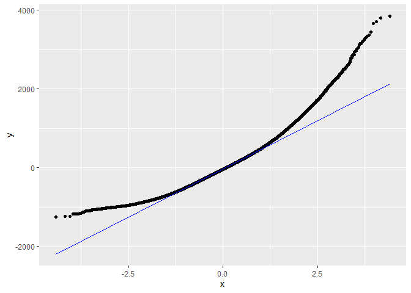
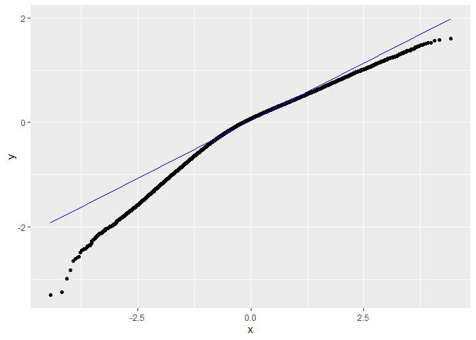
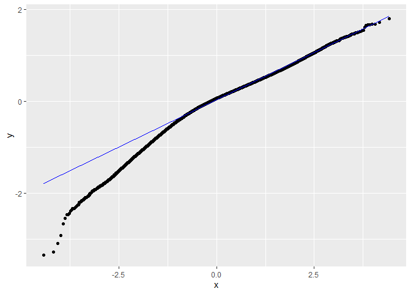
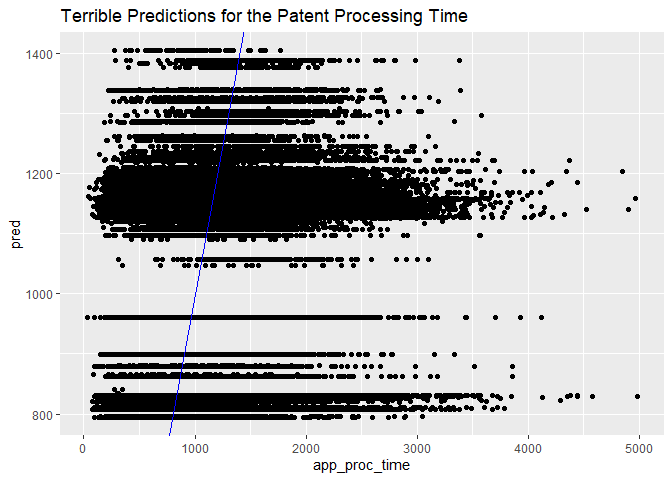

Exercise 4 - Centrality & Efficiency
================
Samuel
2022-05-18

# Import data from exercise

The applications that are filtered and the nodes with their centrality
scores

``` r
app <- read.csv("../ex3/applications.csv")
exam <- read.csv("../ex3/graph_df.csv")
```

``` r
app %>% head()
```

    ##   application_number filing_date examiner_name_last examiner_name_first
    ## 1            8716371  2004-01-26          MCMILLIAN                KARA
    ## 2            9068704  2001-02-23           ROBINSON               BINTA
    ## 3            9091481  2000-06-27           ROBINSON               BINTA
    ## 4            9125199  2000-03-23             ROTMAN                ALAN
    ## 5            9147568  2000-10-30              HUANG              EVELYN
    ## 6            9194823  2000-02-08            RAYMOND             RICHARD
    ##   examiner_name_middle examiner_id examiner_art_unit uspc_class uspc_subclass
    ## 1               RENITA       89557              1627        424        401000
    ## 2                    M       97637              1625        514        354000
    ## 3                    M       97637              1625        549        305000
    ## 4                    L       60246              1625        546        126000
    ## 5                  MEI       70017              1625        514        235200
    ## 6                    L       61876              1624        514        248000
    ##   patent_number patent_issue_date abandon_date disposal_type appl_status_code
    ## 1          <NA>              <NA>         <NA>          PEND              135
    ## 2          <NA>              <NA>   2001-08-09           ABN              161
    ## 3       6482959        2002-11-19         <NA>           ISS              150
    ## 4       6268498        2001-07-31         <NA>           ISS              150
    ## 5       6479488        2002-11-12         <NA>           ISS              250
    ## 6       6518270        2003-02-11         <NA>           ISS              150
    ##     appl_status_date   tc gender  race earliest_date latest_date tenure_days
    ## 1 15may2017 00:00:00 1600 female black    2001-12-19  2017-05-23        5634
    ## 2 16nov2001 00:00:00 1600 female white    2000-01-03  2017-03-10        6276
    ## 3 31oct2002 00:00:00 1600 female white    2000-01-03  2017-03-10        6276
    ## 4 16jul2001 00:00:00 1600   male white    2000-01-05  2015-07-02        5657
    ## 5 13dec2010 00:00:00 1600 female Asian    2000-01-10  2017-03-24        6283
    ## 6 23jan2003 00:00:00 1600   male white    2000-01-04  2017-04-28        6324
    ##   examiner_art_unit3
    ## 1                162
    ## 2                162
    ## 3                162
    ## 4                162
    ## 5                162
    ## 6                162

# Calculate the application processing time

Abandon Date and Issue Date

``` r
app %>% select(abandon_date,patent_issue_date) %>% head()
```

    ##   abandon_date patent_issue_date
    ## 1         <NA>              <NA>
    ## 2   2001-08-09              <NA>
    ## 3         <NA>        2002-11-19
    ## 4         <NA>        2001-07-31
    ## 5         <NA>        2002-11-12
    ## 6         <NA>        2003-02-11

``` r
app <- app %>% 
  filter(!(is.na(abandon_date) & is.na(patent_issue_date))) %>% 
  mutate(app_proc_time = ifelse(
  is.na(abandon_date), as.Date(patent_issue_date)-as.Date(filing_date), as.Date(abandon_date)-as.Date(filing_date)
) )
```

# Combine applications data with the nodes

``` r
df <- app %>% left_join(exam %>% select(name, degree, bet_centrality, clo_centrality), 
                        by=c("examiner_id"="name")) %>% 
  drop_na(degree) %>% filter(app_proc_time>0 & race!="other")  
# some of the examiner weren't in the edges data file so their centrality
# was not calculated

df$examiner_art_unit3 <- as.factor(df$examiner_art_unit3)
df$uspc_class <- as.factor(df$uspc_class)
df$gender <- as.factor(df$gender)
df$race <- as.factor(df$race)


kable(df %>% head())
```

| application_number | filing_date | examiner_name_last | examiner_name_first | examiner_name_middle | examiner_id | examiner_art_unit | uspc_class | uspc_subclass | patent_number | patent_issue_date | abandon_date | disposal_type | appl_status_code | appl_status_date   |   tc | gender | race  | earliest_date | latest_date | tenure_days | examiner_art_unit3 | app_proc_time | degree | bet_centrality | clo_centrality |
|-------------------:|:------------|:-------------------|:--------------------|:---------------------|------------:|------------------:|:-----------|:--------------|:--------------|:------------------|:-------------|:--------------|-----------------:|:-------------------|-----:|:-------|:------|:--------------|:------------|------------:|:-------------------|--------------:|-------:|---------------:|---------------:|
|            9147568 | 2000-10-30  | HUANG              | EVELYN              | MEI                  |       70017 |              1625 | 514        | 235200        | 6479488       | 2002-11-12        | NA           | ISS           |              250 | 13dec2010 00:00:00 | 1600 | female | Asian | 2000-01-10    | 2017-03-24  |        6283 | 162                |           743 |      2 |           0.00 |      0.0003031 |
|            9244182 | 2001-09-07  | DAVIS              | BRIAN               | J                    |       95225 |              1621 | 562        | 532000        | 6384274       | 2002-05-07        | NA           | ISS           |              150 | 19apr2002 00:00:00 | 1600 | male   | white | 2000-01-18    | 2017-05-20  |        6332 | 162                |           242 |      7 |        1031.29 |      0.0004263 |
|            9341809 | 2000-01-05  | OWENS              | AMELIA              | A                    |       93178 |              1625 | 549        | 300000        | 6294680       | 2001-09-25        | NA           | ISS           |              250 | 26oct2009 00:00:00 | 1600 | female | white | 2000-01-03    | 2017-03-10  |        6276 | 162                |           629 |      1 |           0.00 |      0.0003871 |
|            9355446 | 2000-01-19  | LEWIS              | PATRICK             | T                    |       81865 |              1623 | 514        | 045000        | 6689759       | 2004-02-10        | NA           | ISS           |              150 | 22jan2004 00:00:00 | 1600 | male   | white | 2000-01-19    | 2017-05-22  |        6333 | 162                |          1483 |      2 |           0.00 |      0.0001958 |
|            9367261 | 2001-08-10  | DENTZ              | BERNARD             | I                    |       99535 |              1625 | 514        | 179000        | 7829555       | 2010-11-09        | NA           | ISS           |              250 | 05dec2014 00:00:00 | 1600 | male   | white | 2000-01-05    | 2017-05-12  |        6337 | 162                |          3378 |      1 |           0.00 |      0.0003268 |
|            9380835 | 2000-01-31  | HUANG              | EVELYN              | MEI                  |       70017 |              1625 | 546        | 200000        | NA            | NA                | 2004-03-30   | ABN           |              161 | 02sep2004 00:00:00 | 1600 | female | Asian | 2000-01-10    | 2017-03-24  |        6283 | 162                |          1520 |      2 |           0.00 |      0.0003031 |

# Create linear regression for the processing time

## Simple Regression Model

``` r
lm.fit <- lm(data=df, app_proc_time~degree+bet_centrality+clo_centrality)
summary(lm.fit)
```

    ## 
    ## Call:
    ## lm(formula = app_proc_time ~ degree + bet_centrality + clo_centrality, 
    ##     data = df)
    ## 
    ## Residuals:
    ##     Min      1Q  Median      3Q     Max 
    ## -1253.1  -366.5   -42.5   292.5  3844.1 
    ## 
    ## Coefficients:
    ##                  Estimate Std. Error t value Pr(>|t|)    
    ## (Intercept)     1.160e+03  2.087e+00 555.927  < 2e-16 ***
    ## degree          2.289e+00  1.553e-01  14.734  < 2e-16 ***
    ## bet_centrality  3.207e-03  9.184e-04   3.492 0.000479 ***
    ## clo_centrality -8.412e+01  8.024e+00 -10.483  < 2e-16 ***
    ## ---
    ## Signif. codes:  0 '***' 0.001 '**' 0.01 '*' 0.05 '.' 0.1 ' ' 1
    ## 
    ## Residual standard error: 521.3 on 99242 degrees of freedom
    ##   (372 observations deleted due to missingness)
    ## Multiple R-squared:  0.005747,   Adjusted R-squared:  0.005717 
    ## F-statistic: 191.2 on 3 and 99242 DF,  p-value: < 2.2e-16

Using only the data from the centrality, we can see the statistical
results. Someone with a higher degree centrality will have longer
processing time.  
Because of the data, that is someone that asks or has been asks a lot of
questions. Betweeness centrality is also causing higher processing time
and only the closeness centrality is not. So having a higher closeness
centrality reduces the amount of processing time.

Residuals plot

``` r
lm.res = data.frame(resid(lm.fit))
ggplot(data=lm.res, aes(sample=resid.lm.fit.))+stat_qq()+stat_qq_line(col="blue")
```

<!-- -->
This tells me that I should use a log transformation of the processing
time.

## Regression Model with Race and Gender

``` r
lm2.fit <- lm(data=df, log(app_proc_time)~degree+bet_centrality+clo_centrality
              )

summary(lm2.fit)
```

    ## 
    ## Call:
    ## lm(formula = log(app_proc_time) ~ degree + bet_centrality + clo_centrality, 
    ##     data = df)
    ## 
    ## Residuals:
    ##     Min      1Q  Median      3Q     Max 
    ## -3.2939 -0.2650  0.0715  0.3303  1.6036 
    ## 
    ## Coefficients:
    ##                  Estimate Std. Error  t value Pr(>|t|)    
    ## (Intercept)     6.945e+00  1.980e-03 3507.973   <2e-16 ***
    ## degree          2.370e-03  1.473e-04   16.086   <2e-16 ***
    ## bet_centrality  3.890e-06  8.712e-07    4.466    8e-06 ***
    ## clo_centrality -1.210e-01  7.612e-03  -15.895   <2e-16 ***
    ## ---
    ## Signif. codes:  0 '***' 0.001 '**' 0.01 '*' 0.05 '.' 0.1 ' ' 1
    ## 
    ## Residual standard error: 0.4945 on 99242 degrees of freedom
    ##   (372 observations deleted due to missingness)
    ## Multiple R-squared:  0.008657,   Adjusted R-squared:  0.008627 
    ## F-statistic: 288.9 on 3 and 99242 DF,  p-value: < 2.2e-16

Residuals plot

``` r
lm2.res = data.frame(resid(lm2.fit))
ggplot(data=lm2.res, aes(sample=resid.lm2.fit.))+stat_qq()+stat_qq_line(col="blue")
```

<!-- -->
Using the log transformation we can see that it is a lot better.

## Regression with Gender and Race interaction

``` r
lm3.fit <- lm(data=df, log(app_proc_time)~degree+bet_centrality+clo_centrality+
                gender+race + gender*clo_centrality + race*clo_centrality+
                gender*degree + race*degree + gender*race + examiner_art_unit3
              )

summary(lm3.fit)
```

    ## 
    ## Call:
    ## lm(formula = log(app_proc_time) ~ degree + bet_centrality + clo_centrality + 
    ##     gender + race + gender * clo_centrality + race * clo_centrality + 
    ##     gender * degree + race * degree + gender * race + examiner_art_unit3, 
    ##     data = df)
    ## 
    ## Residuals:
    ##     Min      1Q  Median      3Q     Max 
    ## -3.3446 -0.2490  0.0564  0.3057  1.7931 
    ## 
    ## Coefficients:
    ##                               Estimate Std. Error t value Pr(>|t|)    
    ## (Intercept)                  6.661e+00  1.455e-02 457.943  < 2e-16 ***
    ## degree                      -1.318e-03  6.495e-04  -2.030 0.042391 *  
    ## bet_centrality               1.044e-05  8.698e-07  12.001  < 2e-16 ***
    ## clo_centrality               2.115e+02  4.526e+01   4.674 2.96e-06 ***
    ## gendermale                  -2.309e-02  7.450e-03  -3.100 0.001937 ** 
    ## raceblack                    1.008e-01  1.691e-01   0.596 0.550910    
    ## raceHispanic                -1.414e-01  5.262e-02  -2.687 0.007217 ** 
    ## racewhite                    6.277e-02  1.557e-02   4.032 5.55e-05 ***
    ## examiner_art_unit3179        3.323e-01  3.999e-03  83.081  < 2e-16 ***
    ## clo_centrality:gendermale    1.726e-01  1.512e-02  11.411  < 2e-16 ***
    ## clo_centrality:raceblack    -5.766e+02  5.058e+02  -1.140 0.254316    
    ## clo_centrality:raceHispanic  8.808e+02  2.553e+02   3.450 0.000562 ***
    ## clo_centrality:racewhite    -2.115e+02  4.526e+01  -4.674 2.96e-06 ***
    ## degree:gendermale            2.315e-03  3.026e-04   7.649 2.04e-14 ***
    ## degree:raceblack             1.368e-02  7.213e-03   1.897 0.057837 .  
    ## degree:raceHispanic         -1.714e-02  3.528e-03  -4.859 1.18e-06 ***
    ## degree:racewhite            -5.692e-04  6.264e-04  -0.909 0.363519    
    ## gendermale:raceblack         2.216e-01  3.774e-02   5.872 4.31e-09 ***
    ## gendermale:raceHispanic      4.363e-02  4.217e-02   1.035 0.300857    
    ## gendermale:racewhite        -7.171e-03  8.336e-03  -0.860 0.389609    
    ## ---
    ## Signif. codes:  0 '***' 0.001 '**' 0.01 '*' 0.05 '.' 0.1 ' ' 1
    ## 
    ## Residual standard error: 0.4724 on 99226 degrees of freedom
    ##   (372 observations deleted due to missingness)
    ## Multiple R-squared:  0.09554,    Adjusted R-squared:  0.09536 
    ## F-statistic: 551.6 on 19 and 99226 DF,  p-value: < 2.2e-16

Interestingly, the gender doesn’t impact the processing time. The Race
as an impact but is very minor and negligible. In this example, the unit
three digit number is added makes a significant difference. The
coefficients are hard to estimate because of the processing time that is
reduced on a logarithmic base.

Residuals plot

``` r
lm3.res = data.frame(resid(lm3.fit))
ggplot(data=lm3.res, aes(sample=resid.lm3.fit.))+stat_qq()+stat_qq_line(col="blue")
```

<!-- -->

## Plotting the results of the most recent linear model

``` r
pred <- exp(predict(lm3.fit, newdata=df))


# Plot
ggplot(data=df, aes(x=app_proc_time))+
  geom_point(aes(y=pred))+
  geom_abline(col="blue")+
  labs(title="Terrible Predictions for the Patent Processing Time")
```

    ## Warning: Removed 372 rows containing missing values (geom_point).

<!-- -->

^^ Predictions are still pretty bad so I am not sure how those findings
are relevant to the USPTO ^^. Some of the points discussed make sense
but we are not able to explain the application processing time very
precisely meaning that they are a lot of external factors that we
haven’t identified.

Overall, we are seing that the closeness centrality (being as close as
possible to most of the requests in this case) is very helpful in
reducing processing time. In a sense it’s logical because your are
someone that probably plays a very central strategic role and thus have
more experience to solve problem faster. Only the degree centrality is
too ambiguis and can mean that you are sending or receiving a lot of
requests and what we are seing is that it’s not good in terms of
processing time.

The problem with this data, is that we are assuming that the examiner is
the owner of that patent but it’s not necessarily true from my
understanding which is not very representative and doesn’t represent the
processing time well related to the centrality scores of the examiner.
